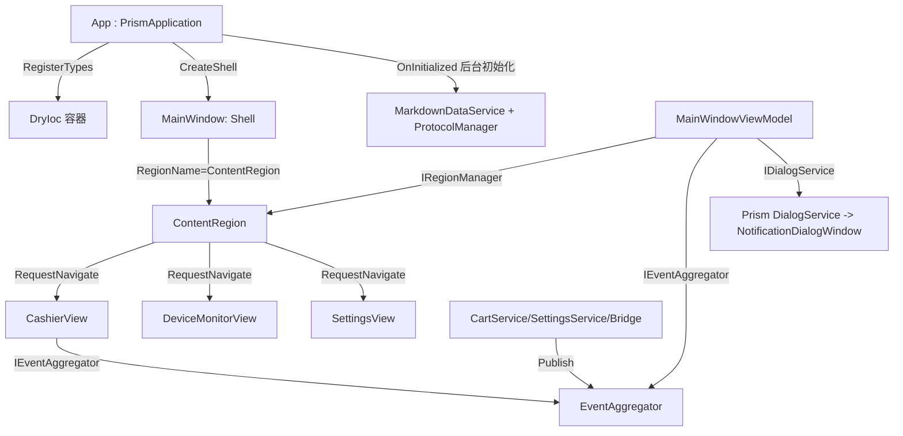

## 需求概述

以现有项目 `CommunityToolkitDemo` 为蓝本，在空目录 `c:\code\WpfStudy\PrismDemo` 中**重建一个等价的新项目**，将 MVVM 框架由 `CommunityToolkit.Mvvm` **完全替换为 Prism**，除框架写法外，界面、交互、业务逻辑与运行效果全部保持一致。

## 核心功能（迁移后必须 1:1 保留）

- **收银台**：分类标签 + 关键字防抖搜索（250ms）、商品卡片加购、购物车增减/移除/清空、条码录入与扫码枪触发、现金/扫码/银行卡支付、找零计算、结算按钮可用性规则、结算走打印/开钱箱/云端上报编排。
- **设备监控**：5 种仿真协议驱动的连接/断开、实时指标表、报文日志（200 条环形缓冲）、报警提示与确认、状态卡片闪烁、进页面订阅/离开退订。
- **设置**：6 项表单校验（门店名/电话/小票份数等）、保存/恢复默认、小票预览联动、保存后全局广播。
- **主窗口外壳**：顶部时钟与日期（跨天才重算）、门店名、协议状态灯（点击跳设备监控）、左侧导航、底部提示条（3.5s 自动归位）、购物车实时汇总。
- **对话框**：Info/Warning/Error/Confirm 四类自定义弹窗，外观与交互（图标配色、遮罩点击关闭、取消按钮显隐）保持不变。
- **启动与退出**：先显示窗口再后台加载 Markdown 数据并连接设备；退出时优雅断开设备并释放资源；全局未处理异常落盘 + 提示。
- **附加**：测试工程一并迁移；模拟数据（Markdown）随程序输出。

## 视觉与交互

界面视觉、布局、动画、配色与交互流程**与原文完全一致**，仅底层 MVVM 框架实现方式改变；页面切换仍保留状态（购物车、日志等）。

## 技术栈

- 目标框架：`net10.0-windows` + `UseWPF`（`Nullable`、`ImplicitUsings`、`LangVersion=latest`）
- UI 框架：WPF（沿用原 XAML 与样式资源）
- MVVM 框架：**Prism 8.1.97 + DryIoc**（`Prism.DryIoc` 8.1.97，MIT 许可）
- 移除：`CommunityToolkit.Mvvm`、`Microsoft.Extensions.DependencyInjection`
- 测试：xUnit 2.9.2 / Microsoft.NET.Test.Sdk 17.12.0 / xunit.runner.visualstudio 2.8.2（沿用）

## 实现方案

### 总体策略

保持原项目"分层 + 接口 + 单例服务 + 单例页面 ViewModel"的架构不变，逐文件把 CommunityToolkit 的 API 替换成 Prism 对应 API；把"自定义导航 + 隐式 DataTemplate + CachedContentControl"替换为 Prism Region 导航；把自有对话框替换为 Prism `IDialogService`。

### 关键映射

| CommunityToolkit.Mvvm | Prism 8 对应实现 |
| --- | --- |
| `ObservableObject` | `Prism.Mvvm.BindableBase` |
| `[ObservableProperty]` 字段 | 手写属性 + `SetProperty(ref _field, value)` |
| `[NotifyPropertyChangedFor(nameof(X))]` | `SetProperty(ref _field, value, nameof(X))` 或在 setter 内 `RaisePropertyChanged(nameof(X))` |
| `[NotifyCanExecuteChangedFor(nameof(C))]` | setter 内 `C.RaiseCanExecuteChanged()` |
| `OnXxxChanged` 分部钩子 | 合并进 setter（`if (SetProperty(...)) { ... }`） |
| `[RelayCommand]`（同步/带参） | `new DelegateCommand(...)` / `new DelegateCommand<T>(...)`（`Prism.Commands`） |
| `[RelayCommand]`（async Task，共 5 个） | **自定义 `AsyncDelegateCommand`**（Prism 8 无内置异步命令） |
| `ObservableRecipient` + `IRecipient<T>` + `IsActive` | **自定义 `ViewModelBase`**（`BindableBase` + `IActiveAware` + `SubscriptionToken` 订阅生命周期） |
| `ObservableValidator` + `[NotifyDataErrorInfo]` | **自定义 `ValidatableBindableBase`**（`BindableBase` + `INotifyDataErrorInfo` + DataAnnotations） |
| `IMessenger.Send(new XxxMessage(v))` | `IEventAggregator.GetEvent<XxxEvent>().Publish(v)` |
| `IRecipient<XxxMessage>.Receive(m)` | `GetEvent<XxxEvent>().Subscribe(方法组, ...)` + `SubscriptionToken` |
| `Ioc.Default` / `ServiceCollection` | `PrismApplication` + `RegisterTypes(IContainerRegistry)`（DryIoc） |
| 自定义导航 + `CachedContentControl` | `RegionManager.RequestNavigate("ContentRegion", key)` + `RegisterForNavigation<TView>(key)` |
| 自有 `IDialogService` + `DialogWindow.Show` | Prism `Services.Dialogs.IDialogService.ShowDialog(name,...)` + `IDialogAware` |


### 关键框架缺口与对策（重要）

1. **Prism 8.1.97 无 `AsyncDelegateCommand`**（该类型为 Prism 9 新增）。需在 `Common/Commands/AsyncDelegateCommand.cs` 自实现，复刻 `AsyncRelayCommand` 语义：`Execute` 为 `async void`，执行期间 `IsRunning=true` 且 `CanExecute` 返回 false（防重入、按钮自动禁用），完成后 `RaiseCanExecuteChanged()`；支持可选 `Func<bool> canExecute`。

- **命令属性名必须与原文一致**（`ScanCommand`/`CheckoutCommand`/`ConnectAllCommand`/`DisconnectAllCommand`/`ToggleCommand`），否则 XAML 绑定会失效。

2. **Prism 8.1.97 无 `ObservableValidator`/`[NotifyDataErrorInfo]`**。需在 `Common/Mvvm/ValidatableBindableBase.cs` 提供等价基类：保留 `ValidateAllProperties()`、`HasErrors`、`GetErrors()`、`ErrorsChanged` 事件，属性 setter 变更即校验；`HasErrors` 变化时抛出通知，供 `SettingsViewModel` 刷新 `SaveCommand.RaiseCanExecuteChanged()` 与 `ValidationSummary`。
3. **`IsActive`/`OnActivated`/`OnDeactivated` 语义需自实现**：`ViewModelBase` 暴露 `IsActive`（`IActiveAware`）与 `EventAggregator`，`IsActive` 变化时调用 `OnActivated()/OnDeactivated()`；`DeviceMonitorViewModel` 依赖该钩子在进/离页面时订阅/退订高频协议事件，必须原样保留。
4. **Prism 弱引用订阅的坑**：`PubSubEvent.Subscribe` 默认 `keepSubscriberReferenceAlive:false`，若用内联 lambda 订阅（闭包对象被 GC）会静默丢订阅。约定：**统一使用方法组订阅**，并保存 `SubscriptionToken`，在 `OnDeactivated`/`Dispose` 中 `token.Dispose()` 退订；`IEventAggregator` 由构造注入，禁止在 VM 内 `new EventAggregator()`。
5. **ViewModelLocator 与容器**：三页面 ViewModel 仍注册为**容器单例**以保证"切页保状态"。视图用 `prism:ViewModelLocator.AutoWireViewModel="True"` 由容器解析 VM；区域注册使用**仅视图重载** `RegisterForNavigation<TView>(key)`（避免 `RegisterForNavigation<TView,TViewModel>` 可能注册 Activator 工厂而绕过 DI），并在 `App` 中重写 `ConfigureViewModelLocator()` 将默认工厂指向 DryIoc 容器。`Views.XxxView` → `ViewModels.XxxViewModel` 命名已符合 Prism 约定。
6. **多实现注入**：`IProtocolDriver` 5 个实现逐个 `RegisterSingleton<IProtocolDriver, XxxDriver>()`，由 DryIoc 解析 `IEnumerable<IProtocolDriver>` 注入 `ProtocolManager`；若出现重复注册异常，改用 `RegisterManySingleton(typeof(XxxDriver), typeof(IProtocolDriver))`。
7. **同实例多契约**：`IProductCatalog`、`IDeviceCatalog` 需与 `PosRepository` 同实例，用 `RegisterSingleton<IProductCatalog>(() => Container.Resolve<PosRepository>())` 形式（工厂惰性求值，不使用 `RegisterSingleton<TFrom,TTo>` 以免产生两个实例）。
8. **启动时序**：`App : PrismApplication` 中 `CreateShell()` 返回 `Container.Resolve<MainWindow>()`；`OnInitialized()` 内 `base.OnInitialized()`（显示外壳）后再 `_ = InitializeAsync()`，保持"窗口先显示、数据后台加载"；初次区域导航也在此时发起，并做"区域是否已注册"的保护判断。

### 对话框迁移要点

- 保留外观：新增 `Views/NotificationDialogView.xaml(.cs)`（UserControl，承载标题/图标/正文/按钮）与 `Views/NotificationDialogWindow.xaml(.cs)`（`Window, IDialogWindow`，复刻原遮罩层、双层阴影、透明无边框、点击遮罩关闭），通过 `containerRegistry.RegisterDialogWindow<NotificationDialogWindow>()` 替换 Prism 默认宿主窗口。
- 新增 `ViewModels/NotificationDialogViewModel : IDialogAware`，`OnDialogOpened` 从 `IDialogParameters` 读取 `title/message/type/isConfirm`，按类型映射图标字形与前景/背景画刷（沿用原 `TryFindResource` 查资源键的策略，找不到时回退中性色）。
- 在 `Common/Dialogs/DialogServiceExtensions.cs` 提供 `ShowInfo/ShowWarning/ShowError/Confirm` 扩展方法包装 Prism `IDialogService.ShowDialog(...)`，使原 VM 调用点与"Confirm 返回 bool"的同步语义保持不变（`ShowDialog` 为模态，回调在返回前完成）。

### 性能与可靠性

- 迁移不改变原有性能设计：防抖搜索、RangeObservableCollection 批量 Reset、报文无锁队列 + 150ms 批量刷新、200 条环形缓冲、静态冻结画刷均原样保留。
- Region 导航每次新建 View（用户已确认移除视图缓存）；**状态仍然保留**，因为状态载体是单例 ViewModel；需在验证阶段确认切页后购物车/日志不丢。
- 事件订阅统一用 `SubscriptionToken` 管理，避免 Prism 弱引用订阅泄漏或意外失效。

### 执行注意事项

- 全量替换命名空间 `CommunityToolkitDemo` → `PrismDemo`，Pack URI `/CommunityToolkitDemo;component/...` → `/PrismDemo;component/...`。
- 错误日志目录改为 `%LocalAppData%\PrismDemo\error.log`。
- 主工程 csproj 保留 `Compile/None/Page Remove="tests\**"` 与 `Data\*.md` 的 `CopyToOutputDirectory`，否则测试代码会被编进主程序、数据文件不会随输出复制。
- 删除 `Common/Controls/CachedContentControl.cs`；`Common/UiDispatcher.cs`、`Common/Behaviors`、`Common/Converters`、`Common/Collection`、`VirtualizingWrapPanel` 原样保留（非框架代码）。
- `ProtocolMessageBridge` 继续先 `UiDispatcher.Post` 切回 UI 线程再 `Publish`，精确保留线程与投递语义。
- 原 `docs/` 系列文档不在代码功能范围内，本次不迁移（如需保留可后续单独改写）。

## 架构设计



- 分层：表现层（Views / ViewModels）→ 业务服务层（Services）→ 通信层（Protocols）→ 数据层（PosRepository / MarkdownDataService），与原架构一致。
- 事件总线由 `IEventAggregator`（Prism 默认注册的全局单例）承担原 `WeakReferenceMessenger.Default` 的角色。
- 页面 ViewModel 均为容器单例，导航切换复用同一实例，状态不丢。

## 目录结构

```
PrismDemo/
├── PrismDemo.csproj                        # [NEW] 引用 Prism.DryIoc 8.1.97；RootNamespace/AssemblyName=PrismDemo
├── App.xaml                                # [MODIFY] 根节点改 prism:PrismApplication；移除 3 个隐式 DataTemplate
├── App.xaml.cs                             # [MODIFY] : PrismApplication；CreateShell/RegisterTypes/ConfigureViewModelLocator/OnInitialized/OnExit
├── Data/                                   # [COPY] *.md 随输出复制
├── Common/
│   ├── UiDispatcher.cs                     # [COPY] 原样保留
│   ├── Commands/AsyncDelegateCommand.cs    # [NEW] Prism 8 缺失的异步命令
│   ├── Mvvm/ViewModelBase.cs               # [NEW] BindableBase + IActiveAware + 订阅生命周期
│   ├── Mvvm/ValidatableBindableBase.cs     # [NEW] BindableBase + INotifyDataErrorInfo + DataAnnotations
│   ├── Dialogs/DialogServiceExtensions.cs  # [NEW] Prism IDialogService 的 ShowInfo/ShowWarning/ShowError/Confirm 扩展
│   ├── Collection/RangeObservableCollection.cs # [COPY] 改命名空间
│   ├── Converters/Converters.cs            # [COPY] 改命名空间
│   ├── Behaviors/AttachedProps.cs          # [COPY] 改命名空间
│   ├── Controls/VirtualizingWrapPanel.cs   # [COPY] 改命名空间（不迁移 CachedContentControl）
│   └── Styles/{Colors,Controls}.xaml       # [COPY] 改 pack URI
├── Events/                                 # [NEW] 9 个 PubSubEvent<T> 子类 + EventPayloads.cs（原 Messages）
├── Models/*.cs                             # [COPY] CartItem 改 BindableBase，其余原样
├── Protocols/**                            # [COPY] 原样
├── Services/**                             # [COPY] CartService/SettingsService/ProtocolMessageBridge 改 IEventAggregator
├── ViewModels/                             # [MODIFY] BindableBase / 手写属性 / DelegateCommand / 事件订阅
│   ├── MainWindowViewModel.cs              # [MODIFY] IRegionManager 导航 + 6 个事件订阅
│   ├── CashierViewModel.cs                 # [MODIFY] 9 个命令（含 2 个异步）+ 4 个事件订阅
│   ├── DeviceMonitorViewModel.cs           # [MODIFY] OnActivated/OnDeactivated + 异步命令
│   ├── SettingsViewModel.cs                # [MODIFY] ValidatableBindableBase + Save/Reset
│   ├── DeviceCardViewModel.cs / LiveMetricItem.cs / ProtocolStatusItem.cs # [MODIFY] BindableBase
│   ├── NavItem.cs                          # [COPY] 原样
│   └── NotificationDialogViewModel.cs      # [NEW] IDialogAware
└── Views/
    ├── MainWindow.xaml(.cs)                # [MODIFY] ContentControl + prism:RegionManager.RegionName="ContentRegion"
    ├── CashierView.xaml(.cs)               # [MODIFY] 增加 xmlns:prism + AutoWireViewModel
    ├── DeviceMonitorView.xaml(.cs)         # [MODIFY] 同上
    ├── SettingsView.xaml(.cs)              # [MODIFY] 同上
    ├── NotificationDialogView.xaml(.cs)    # [NEW] 对话框内容视图
    └── NotificationDialogWindow.xaml(.cs)  # [NEW] 自定义 IDialogWindow（保留原外观）
tests/
└── PrismDemo.Tests/                        # [MIGRATE] 15 个测试文件 + csproj（ProjectReference 指向 PrismDemo）
```

## 关键代码结构

```
// Common/Commands/AsyncDelegateCommand.cs
public sealed class AsyncDelegateCommand : ICommand
{
    public AsyncDelegateCommand(Func<Task> execute, Func<bool>? canExecute = null);
    public bool IsRunning { get; }
    public event EventHandler? CanExecuteChanged;
    public void RaiseCanExecuteChanged();
    public bool CanExecute(object? parameter);
    public void Execute(object? parameter);   // async void：置 IsRunning → 等待 → 复位并 RaiseCanExecuteChanged
}

// Common/Mvvm/ViewModelBase.cs
public abstract class ViewModelBase : BindableBase, IActiveAware
{
    protected IEventAggregator EventAggregator { get; }
    public bool IsActive { get; set; }               // 变更时触发 OnActivated/OnDeactivated 与 IsActiveChanged
    public event EventHandler? IsActiveChanged;
    protected virtual void OnActivated();
    protected virtual void OnDeactivated();
    protected void Subscribe<TEvent, TPayload>(Action<TPayload> handler) where TEvent : PubSubEvent<TPayload>, new();
}

// Common/Mvvm/ValidatableBindableBase.cs
public abstract class ValidatableBindableBase : BindableBase, INotifyDataErrorInfo
{
    public bool HasErrors { get; }
    public IEnumerable<ValidationResult> GetErrors(string? propertyName = null);
    public event EventHandler<DataErrorsChangedEventArgs>? ErrorsChanged;
    protected void ValidateProperty(object? value, string propertyName);  // setter 内调用
    protected void ValidateAllProperties();
}
```

## Agent Extensions

### SubAgent

- **code-explorer**
- Purpose: 在执行初期一次性盘点 `CommunityToolkitDemo` 中所有 CommunityToolkit 引用点（文件、类型、命令名、属性通知、订阅点、DI 注册项），产出精确的迁移清单，避免遗漏。
- Expected outcome: 一份"文件 → 需替换的框架写法"完整清单，作为后续逐个迁移的依据。

### Skill

- **lsp-code-analysis**
- Purpose: 在迁移收尾阶段用语言服务做符号级引用/实现分析，确认 `CommunityToolkit.*`、`IMessenger`、`ObservableObject/ObservableRecipient/ObservableValidator`、`[RelayCommand]`、`Ioc.Default` 等已全部清除，并核对 XAML 绑定的命令名与 ViewModel 属性名一一对应。
- Expected outcome: 无框架残留的确认结论 + 绑定名一致性核对结果，作为编译与回归验证的前置保障。