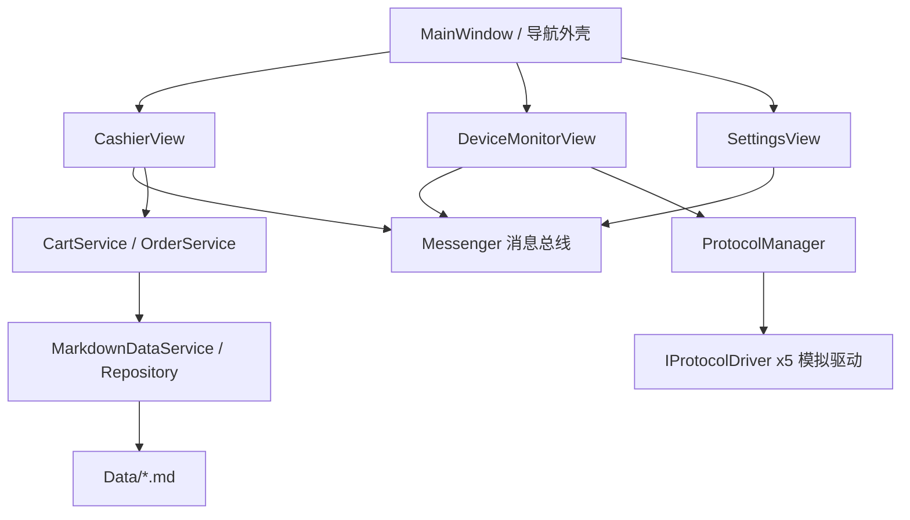

## 产品概述

一个面向 WPF 上位机学习者的收银机 POS 桌面应用。整体采用 MVVM 模式，界面为原生 WPF 自绘风格。商品、订单等业务数据来自 Markdown 表格文件，启动时解析到内存；同时提供 Modbus / OPC UA / 串口 / Socket / MQTT 五种通信协议的模拟接入，用于模拟电子秤、扫码枪、打印机、钱箱等外设。应用重点演示框架各项 MVVM 能力，代码具备教学性与可读性，运行后即可完整走通收银流程并观察设备通信状态。

## 核心功能

- **收银台**：按分类浏览商品网格，点击加入购物车，支持数量增减、删除、清空，实时显示合计金额。
- **结算支付**：选择支付方式（现金/扫码/银行卡），校验实收金额与找零，完成后生成订单。
- **设备监控**：以卡片形式展示 5 种协议的连接状态，支持连接/断开；实时刷新模拟数据（称重、条码、打印、钱箱信号），展示原始报文日志与报警提示。
- **设置**：参数表单录入（门店名称、小票抬头、默认支付方式等），带必填与取值范围的即时校验。
- **跨页面消息**：扫码枪扫到条码直接进入收银台、支付完成通知主窗口状态栏与订单记录、设备报警全局广播。
- **导航外壳**：左侧导航切换页面，顶部显示门店信息、时钟与各协议连接状态指示。

## 视觉与交互效果

左侧深色导航栏加浅色内容区，卡片式商品网格与购物车列表层次分明；金额、合计使用醒目强调色与大号数字；连接状态用彩色圆点表示；按钮、卡片、列表项均有悬停与选中反馈，整体呈现专业收银终端的干净、紧凑、易点按的观感。

## 技术栈选型

- 目标框架：`net10.0-windows`（本机仅安装 .NET 10 SDK 10.0.401 与 WindowsDesktop 10.0.12 目标包，无 net6/8/9 目标包，必须使用 net10.0-windows 才能启用 WPF 并离线构建）。
- UI：原生 WPF（`UseWPF=true`），不引第三方 UI 库；样式、模板、转换器全部自写。
- MVVM：`CommunityToolkit.Mvvm`（源生成器），这是唯一必需的第三方包。
- 依赖注入：`Microsoft.Extensions.DependencyInjection`（通过 `CommunityToolkit.Mvvm.DependencyInjection.Ioc` 暴露全局容器）。
- 协议：不引 NModbus / MQTTnet / OPCFoundation 等库，全部自实现模拟驱动，保证零第三方协议依赖。
- 数据：Markdown 表格文件作为数据源，自写解析器。
- 构建命令因 `dotnet` 不在 PATH，需使用 `C:\Program Files\dotnet\dotnet.exe`。

## CommunityToolkit.Mvvm 知识点覆盖清单

- `ObservableObject` 基类与 `[ObservableProperty]` 源生成器（含生成的 `OnXxxChanged` 分部钩子、`XxxChanging/Changed`）。
- `[RelayCommand]` 源生成器：同步命令、`AsyncRelayCommand`（异步与取消）、`CanExecute` 条件、`[NotifyCanExecuteChangedFor]`。
- 属性联动：`[NotifyPropertyChangedFor]`、`[NotifyCanExecuteChangedFor]`、`[NotifyDataErrorInfo]`。
- `ObservableValidator` 数据校验：与 `[ObservableProperty]` 配合，使用 `Required`、`RangeAttribute` 等特性。
- 消息机制：`WeakReferenceMessenger` / `IMessenger`，值消息类（如 `ValueChangedMessage<T>`）、`ObservableRecipient`、`IRecipient<T>`、`OnActivated/OnDeactivated`、`IsActive`，实现跨页面通信。
- `Ioc`：容器初始化、`Ioc.Default.GetService<T>()` 解析 ViewModel、消息接收器注册。
- 可选补充：`Microsoft.Xaml.Behaviors.Wpf` 仅用于演示交互行为，属于独立包；若坚持严格零第三方依赖，改用附加属性实现"回车结算""扫码触发"等交互。方案默认不引入该包，用附加属性 + DataTemplate 实现。

## 实现方案

1. **分层架构**：表现层（Views + ViewModels）→ 业务服务层（CartService / OrderService / DialogService）→ 数据访问层（MarkdownDataService + Repository）→ 通信层（IProtocolDriver + ProtocolManager）。各层通过接口注入，`App.xaml.cs` 统一注册。
2. **数据流**：Markdown 文件 → `MarkdownTableParser` 解析为领域模型 → Repository 内存缓存 → Service 查询/写入 → ViewModel 绑定；下单/清空等操作写回内存并产生订单记录，体现数据与代码分离。
3. **协议抽象**：统一 `IProtocolDriver`（Connect / Disconnect / Send / 状态与收发事件），统一报文模型 `ProtocolFrame`。`ProtocolDriverBase` 用 `Task` + `CancellationTokenSource` 后台循环按不同周期生成仿真帧（Modbus 寄存器、OPC UA 节点、串口称重、Socket 心跳、MQTT 主题消息），由 `ProtocolManager` 聚合管理并向 UI 推送。
4. **线程模型**：模拟驱动在后台线程产生数据，通过 `Application.Current.Dispatcher.InvokeAsync` 或事件回调切回 UI 线程再更新可观察集合，避免跨线程访问 UI；`WeakReferenceMessenger` 在 UI 线程投递消息。
5. **导航方案**：`MainWindowViewModel.CurrentViewModel` 作为当前页 ViewModel，配合 `ContentControl` + 隐式 `DataTemplate`（ViewModel 类型 → View）自动渲染，避免手写页面切换代码。

## 性能与可靠性

- 数据量小（数十条商品、订单），Markdown 解析在启动时一次性完成，复杂度 O(行数)，无性能压力。
- 协议模拟循环使用 `async Task.Delay(period, token)` 而非紧循环，空闲零占用；断开时取消 CancellationToken 释放资源。
- 报文日志使用固定容量环形缓冲（如最多 200 条）并批量刷新，避免无界增长导致内存膨胀。
- 所有驱动实现 `IDisposable`（或 `IAsyncDisposable`），窗口关闭时统一断开，防止后台任务泄漏。

## 架构设计



## 目录结构

```
CommunityToolkitDemo/
├── CommunityToolkitDemo.csproj   # [NEW] net10.0-windows，UseWPF，引 CommunityToolkit.Mvvm 与 Microsoft.Extensions.DependencyInjection；Data/*.md 设为 Content 并 CopyToOutputDirectory
├── App.xaml                      # [NEW] 合并全局样式资源字典，注册 ContentControl 的 VM→View DataTemplate 映射
├── App.xaml.cs                   # [NEW] 构建 ServiceCollection、注册服务/协议驱动/ViewModel、初始化 Ioc、启动主窗口、退出时释放协议
├── Data/
│   ├── products.md               # [NEW] 商品模拟数据表（编号/名称/分类/单价/条码/库存）
│   ├── categories.md             # [NEW] 商品分类表
│   ├── orders.md                 # [NEW] 历史订单表（用于订单列表展示与写回示例）
│   └── devices.md                # [NEW] 设备表（驱动类型/名称/端口或地址/周期）
├── Common/
│   ├── Styles/Colors.xaml        # [NEW] 颜色、画刷资源
│   ├── Styles/Controls.xaml      # [NEW] Button/TextBox/ListBox/DataGrid/Card 样式与 ControlTemplate
│   ├── Converters/*.cs           # [NEW] BoolToVisibility、金额格式化、状态转画刷、枚举转显示文本等转换器
│   └── Behaviors/AttachedProps.cs# [NEW] 附加属性实现回车触发、自动滚动到底部等交互
├── Models/
│   ├── Product.cs / Category.cs  # [NEW] 商品与分类模型
│   ├── CartItem.cs / Order.cs / OrderItem.cs / PaymentMethod.cs  # [NEW] 购物车项、订单、支付方式
│   ├── DeviceInfo.cs             # [NEW] 设备信息模型
│   └── ProtocolFrame.cs / ProtocolType.cs  # [NEW] 统一报文模型与协议枚举
├── Services/
│   ├── IMarkdownDataService.cs / MarkdownDataService.cs  # [NEW] 读取并解析 Data/*.md，提供商品/订单/设备集合
│   ├── MarkdownTableParser.cs    # [NEW] 通用 Markdown 表格解析（识别表头与分隔行，返回字典列表）
│   ├── ICartService.cs / CartService.cs    # [NEW] 购物车增删改、合计计算、清空
│   ├── IOrderService.cs / OrderService.cs  # [NEW] 下单、生成订单、写回订单列表
│   └── IDialogService.cs / DialogService.cs# [NEW] 提示/确认对话框封装，供 VM 调用
├── Protocols/
│   ├── IProtocolDriver.cs        # [NEW] 统一协议抽象（状态、连接/断开、发送、接收事件、Dispose）
│   ├── ProtocolDriverBase.cs     # [NEW] 后台仿真循环、状态变更与报文事件公共实现
│   ├── Simulated/                # [NEW] ModbusTcpSimDriver、OpcUaSimDriver、SerialPortSimDriver、SocketSimDriver、MqttSimDriver
│   └── IProtocolManager.cs / ProtocolManager.cs  # [NEW] 驱动注册、统一启停、状态聚合与数据推送
├── Messages/
│   ├── BarcodeScannedMessage.cs   # [NEW] 扫码枪条码消息
│   ├── CartChangedMessage.cs      # [NEW] 购物车变更消息
│   ├── DeviceAlarmMessage.cs      # [NEW] 设备报警消息
│   ├── PaymentCompletedMessage.cs # [NEW] 支付完成消息
│   └── NavigateMessage.cs         # [NEW] 页面导航消息
├── ViewModels/
│   ├── MainWindowViewModel.cs     # [NEW] ObservableRecipient；导航、当前 VM、状态栏数据、跨页消息接收
│   ├── CashierViewModel.cs        # [NEW] 商品网格、购物车、结算命令、金额校验
│   ├── DeviceMonitorViewModel.cs  # [NEW] 驱动开关、实时数据、报警与报文日志
│   └── SettingsViewModel.cs       # [NEW] ObservableValidator 表单与校验
└── Views/
    ├── MainWindow.xaml/.cs        # [NEW] 顶部状态栏 + 左侧导航 + 内容区
    ├── CashierView.xaml/.cs       # [NEW] 分类/商品网格 + 购物车 + 结算面板
    ├── DeviceMonitorView.xaml/.cs # [NEW] 协议卡片 + 实时数据表 + 报文日志
    └── SettingsView.xaml/.cs      # [NEW] 参数表单与校验提示
```

## 关键代码结构

```
// 统一协议抽象：5 种协议驱动共同实现
public interface IProtocolDriver : IDisposable
{
    string Name { get; }
    ProtocolType Type { get; }
    ConnectionState State { get; }          // Disconnected / Connecting / Connected / Faulted
    event EventHandler<ProtocolFrame> FrameReceived;
    event EventHandler<ConnectionState> StateChanged;
    Task ConnectAsync(CancellationToken ct = default);
    Task DisconnectAsync();
    Task SendAsync(ProtocolFrame frame, CancellationToken ct = default);
}

// 统一报文模型：屏蔽各协议差异，供 UI 统一展示
public sealed class ProtocolFrame
{
    public ProtocolType Type { get; init; }
    public DateTime Timestamp { get; init; }
    public string Address { get; init; }    // 从站地址/节点ID/端口/主题
    public string Payload { get; init; }    // 原始报文或数据
    public byte[]? Raw { get; init; }
}
```

## 实现要点

- `csproj` 中 Data/*.md 必须设置 `CopyToOutputDirectory=PreserveNewest`，运行时通过 `AppContext.BaseDirectory` 定位文件，避免路径错误。
- ViewModel 一律通过构造函数注入服务，禁止 `new` 具体实现；`App.xaml.cs` 中显式注册并调用 `Ioc.Default.ConfigureServices`。
- 源生成器要求类型为 `partial`，且 `[ObservableProperty]` 字段用小写命名（生成 PascalCase 属性）。
- 后台驱动的集合更新必须切回 UI 线程；报文日志做容量上限与节流，避免界面卡顿。
- Messenger 使用 `WeakReferenceMessenger.Default` 或注入 `IMessenger`，页面在 `OnActivated/OnDeactivated` 注册/注销接收，防止重复订阅。
- 关闭窗口时统一 `DisconnectAsync` 并取消挂起的 CancellationToken，保证进程正常退出。
- 修改集中在新增文件，不影响无关逻辑；先 `restore` 验证 NuGet 可用性，若离线失败则给出说明并改用本地缓存包。

## 设计风格

现代专业收银终端风格：深色导航 + 浅色内容区，卡片化信息层级，紧凑但易点按。采用原生 WPF 自绘样式，统一圆角、阴影、悬停与选中过渡，整体干净、克制、数据密度高，兼顾收银场景的快速识别与操作效率。

## 页面规划

共 4 个界面：主窗口外壳、收银台、设备监控、设置。

### 1. 主窗口外壳

- **顶部状态栏**：左侧门店名称与 Logo 占位，中间当前时间与收银员信息，右侧 5 个协议状态彩色圆点（绿=已连接、灰=未连接、红=故障），点击可跳转监控页。
- **左侧导航栏**：深色背景，纵向排列"收银台/设备监控/设置"三项，含图标与文字，选中项高亮并有左侧指示条。
- **内容区**：浅灰底色的 `ContentControl`，承载当前页面 View，带轻微淡入切换动画。
- **底部提示条**：显示最近一条全局消息（如"扫码枪已连接""支付成功"），3 秒后自动淡出。

### 2. 收银台

- **商品分类栏**：顶部横向分类标签，选中项下划高亮，点击过滤商品网格。
- **商品网格**：卡片式排列，每张卡显示名称、单价、库存条码，悬停上浮，点击加入购物车并有轻微缩放反馈。
- **购物车列表**：中部列表，显示商品名、单价、数量（加减按钮）、小计，支持单项删除与一键清空；行悬停高亮。
- **结算面板**：右侧固定，大号合计金额，选择支付方式（现金/扫码/银行卡），输入实收金额并即时显示找零，校验通过后"结算"按钮点亮，点击完成支付并弹出成功提示。

### 3. 设备监控

- **协议卡片区**：顶部横向 5 张卡片（Modbus/OPC UA/串口/Socket/MQTT），含名称、连接地址、状态圆点与"连接/断开"开关按钮。
- **实时数据区**：中部表格展示各驱动推送的模拟数据（称重值、条码、打印机状态、钱箱信号等），数值变化带高亮闪烁。
- **报文日志区**：下部等宽字体列表，滚动展示原始报文（时间/方向/地址/内容），新报文自动滚到底部，使用等宽字体。
- **报警提示**：异常时卡片变红并浮出警示条，可点击确认清除，同时广播到全局提示条。

### 4. 设置

- **门店信息表单**：门店名称、地址、联系电话输入框，含即时校验提示（必填、格式）。
- **小票设置**：小票抬头、页脚文本、是否打印二维码开关。
- **收款设置**：默认支付方式下拉、找零提示开关、金额舍入方式。
- **保存栏**：底部"保存/重置"按钮，校验不通过时保存按钮禁用并显示错误汇总。

## 字体与色彩

标题使用 20-22px 半粗体，副标题 15px 中等字重，正文 13-14px 常规字重，金额使用等宽数字样式突出。主色为蓝，强调色用于合计金额与关键操作，功能色区分成功、警示与错误；深色导航与浅色内容形成清晰对比，保证长时间使用下仍清晰易读。

## Agent Extensions

### Skill

- **lsp-code-analysis**
- Purpose: 在实现完成后，通过语义分析核对 CommunityToolkit 源生成器产生的成员（如 `[ObservableProperty]` 生成的属性、`[RelayCommand]` 生成的命令）的定义与引用，确认 XAML 绑定路径与命令名真实存在。
- Expected outcome: 输出源生成成员与绑定目标的一致性结论，定位并修正命名不匹配的绑定，确保编译与运行无绑定错误。