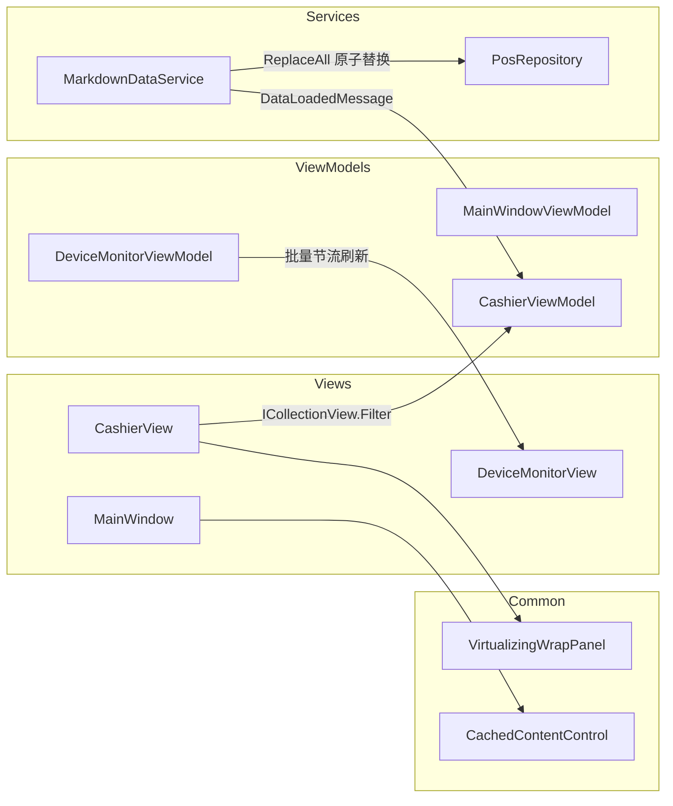

## 产品概述

对现有「智汇 POS 收银终端」（WPF + CommunityToolkit.Mvvm 演示项目）做性能与稳定性优化，保持现有界面布局、交互与业务行为完全不变（收银、购物车、结算、设备监控、设置校验），仅改善运行表现。

## 核心问题与优化目标

1. **UI 加载大量数据卡顿**

- 商品网格（`CashierView`）用 `ScrollViewer + ItemsControl + WrapPanel`，WPF 原生 WrapPanel 不虚拟化，所有商品卡片（Button+Grid+多 TextBlock）一次性实例化。
- 实时数据表与报文日志（`DeviceMonitorView`）同为 `ScrollViewer + ItemsControl`，日志可达 200 行 × 6 列，全部常驻视觉树。
- 搜索框 `UpdateSourceTrigger=PropertyChanged`，每敲一个字符就 `Products.Clear()` + N 次 `Add`，触发 N+1 次集合通知并全量重排。
- 高频报文逐帧 `Logs.Add` + `RemoveAt(0)`，配合 `AutoScrollToEnd` 持续布局与滚动。
- 目标：列表滚动/过滤/报文刷新在高数据量下仍保持流畅，无可见卡顿。

2. **频繁切换页面内存占用**

- `ContentControl + 隐式 DataTemplate`，每次导航都重建整个 View 视觉树（全部卡片/日志行），产生内存峰值与 GC 压力；VM 单例数据仍驻留。
- `OnSelectedNavItemChanged` 无条件解析 `DeviceMonitorViewModel`，任何导航都会提前实例化设备监控页。
- `PosRepository.Orders` 单调增长、从不裁剪；部分订阅缺少生命周期管理。
- 目标：反复切换页面后内存稳定、无明显增长或峰值抖动。

3. **数据异步加载问题**

- `App.OnStartup` 用 `Task.Run(...).GetAwaiter().GetResult()` 同步阻塞 UI 线程，窗口显示被推迟。
- `MarkdownDataService.LoadAsync` 串行读取 4 个文件，且先 Clear 再逐文件填充，存在部分加载的不一致窗口。
- `ConnectAll/DisconnectAll` 串行连接 5 个驱动；结算外设动作全串行；fire-and-forget 无异常处理。
- 目标：启动不阻塞、可感知加载完成与失败，IO/连接尽可能并行且异常可控。

## 技术栈

- 运行平台：WPF，`net10.0-windows`，`UseWPF=true`，`Nullable/ImplicitUsings=enable`，`LangVersion=latest`。
- MVVM：`CommunityToolkit.Mvvm 8.4.2`（`ObservableObject` / `ObservableRecipient` / `[ObservableProperty]` / `[RelayCommand]` / `IMessenger`）。
- DI：`Microsoft.Extensions.DependencyInjection 10.0.12`（现有容器与 Singleton 注册保持不变）。
- 不新增任何第三方包：虚拟化、视图缓存、批量刷新均使用 WPF 框架自带能力实现。

## 实现方案

### 1) UI 卡顿

- **列表虚拟化**：新增 `Common/Controls/VirtualizingWrapPanel.cs`（继承 `VirtualizingPanel` 并实现 `IScrollInfo`，带测量/滚动偏移与容器回收），把商品网格由 `ItemsControl + WrapPanel` 改为 `ListBox`（`IsVirtualizing=True`、`VirtualizationMode=Recycling`、`ScrollViewer.CanContentScroll=True`、`ItemsPanel=VirtualizingWrapPanel`），复用现有 `ProductCardButton` 样式与空态，布局外观不变。
- 实时数据表与报文日志改为 `ListBox` + `VirtualizingStackPanel` + `VirtualizingPanel.IsVirtualizing/Recycling`（行高固定，虚拟化收益最大）；卡片内的小指标列表仍保持原样。
- **过滤与通知**：`CashierViewModel` 改用 `ICollectionView.Filter` 谓词 + `Refresh()`（不重建集合、配合虚拟化），并加 ~250ms 防抖；`HasProducts`/商品数量改为基于视图计数。
- **高频刷新节流**：`DeviceMonitorViewModel` 用后台/线程安全队列接收报文，由单个 `DispatcherTimer`（~150ms）批量入列并批量裁剪，替代逐帧 `Add + RemoveAt(0)`；指标更新用 `ProtocolType` 字典索引替代 `Cards.FirstOrDefault`；只在值变化时置 `IsFlashing`，闪烁统一由现有 `_flashTimer` 清除。
- `MainWindowViewModel` 时钟：时间每秒更新，日期仅在跨天时更新。

### 2) 内存

- **视图缓存复用**：新增 `Common/Controls/CachedContentControl.cs`，按 ViewModel 类型缓存由隐式 DataTemplate 加载出的 View 实例，切换回同一页面时复用旧视觉树与容器，避免每次导航重建；`MainWindow.xaml` 改用它承载 `CurrentViewModel`。
- **去除提前实例化**：`OnSelectedNavItemChanged` 用 `CurrentViewModel is DeviceMonitorViewModel` 判断进出，仅在实际创建后才激活/停用，去掉无条件的 `GetService<DeviceMonitorViewModel>()`。
- **无界集合收口**：`PosRepository.Orders` 增加上限裁剪（如 2000 条，超出移除最旧）；给 `Metrics` 增加软上限保护说明。
- **生命周期**：`MainWindowViewModel` 实现 `IDisposable`，退订 `DriverStateChanged`、停止 `_clockTimer/_statusTimer`；`App.OnExit` 释放各页面 VM；保持 `DeviceMonitorViewModel.OnActivated/OnDeactivated` 的既有正确范式。

### 3) 异步加载

- `App.OnStartup` 改为：构建服务 → `window.Show()`（先出界面）→ `_ = InitializeAsync()`；`InitializeAsync` 内 `await Task.Run(() => dataService.LoadAsync())` 后再 `await manager.ConnectAllAsync()`，整体 try/catch 并 `Debug.WriteLine` 记录，避免 `sync-over-async` 与静默失败。
- `MarkdownDataService.LoadAsync`：4 个文件 `Task.WhenAll` 并行读取与解析到本地列表，成功后通过新增 `PosRepository.ReplaceAll(...)` 一次性原子替换，消除"部分加载"中间态；`LoadErrors` 保留。
- 新增 `Messages/DataLoadedMessage.cs`（沿用 `ValueChangedMessage<T>` 范式），加载完成后广播；`CashierViewModel` 订阅后重建分类/商品视图，保证"先出窗口后到数据"时界面能自动刷新。
- **并行化**：`ProtocolManager.ConnectAllAsync/DisconnectAllAsync` 用 `Task.WhenAll` + 逐驱动 try/catch 隔离失败；`CheckoutAsync` 保持"客显→落库"顺序，将打印/开钱箱/上报三件事并行 `Task.WhenAll`；`ScanAsync` 加异常处理与重入保护；`DeviceMonitorViewModel.ConnectAll/DisconnectAll` 增加 busy 状态与异常兜底。
- 复杂度：过滤由 O(n) 通知 → O(n) 单次刷新无集合通知；日志刷新由每帧 O(1) UI 操作 → 每 150ms 一次批量；虚拟化将可视元素由 O(n) 降为 O(可视区)。

## 实现说明

- 严格复用现有资源键（`PlainListBox`、`CardListBox`、`CardBorder`、`ShadowCard`、`PageRoot`、`ProductCardButton` 等），不改视觉样式与配色。
- 线程模型沿用 `Common/UiDispatcher`：后台事件统一切回 UI 线程后再改集合；批量刷新计时器运行在 `DispatcherPriority.Background`，避免与输入抢占。
- 保持现有中文注释与 CommunityToolkit 知识点标注风格，新增类同样补注释。
- 兼容性：不改动任何公开业务接口行为；`PosRepository` 新增方法为增量，不破坏现有调用方。
- 控制爆炸半径：优先改 XAML 的 ItemsPanel/虚拟化属性与 ViewModel 内部刷新策略，不重构分层与 DI 注册。

## 架构设计

沿用现有分层（Views / ViewModels / Services / Protocols / Common），仅做增量：

- 表现层：`MainWindow` 使用 `CachedContentControl`；商品/实时数据/日志列表切换为可虚拟化 `ListBox`。
- 表现逻辑层：过滤、节流、生命周期、并行编排集中在对应 ViewModel。
- 服务/通信层：并行加载与原子替换、并行连接、异常隔离。
- 支撑层：`Common/Controls` 新增虚拟化面板与缓存容器；`Messages` 新增数据就绪消息。



## 目录结构

```
CommunityToolkitDemo/
├── Common/Controls/
│   ├── VirtualizingWrapPanel.cs   # [NEW] 虚拟化换行面板：继承 VirtualizingPanel 并实现 IScrollInfo，支持容器回收；用于商品卡片网格，保持换行布局同时仅实例化可视项
│   └── CachedContentControl.cs    # [NEW] 缓存式内容宿主：按内容类型缓存隐式 DataTemplate 生成的 View 实例，切换页面复用旧视觉树，消除每次导航重建
├── Messages/
│   └── DataLoadedMessage.cs       # [NEW] 数据加载完成消息：沿用 ValueChangedMessage<T> 范式，携带加载结果/错误信息，供页面刷新与提示
├── Views/
│   ├── MainWindow.xaml            # [MODIFY] 用 CachedContentControl 承载 CurrentViewModel；其余布局不变
│   ├── CashierView.xaml           # [MODIFY] 商品网格改 ListBox + VirtualizingWrapPanel（IsVirtualizing/Recycling/CanContentScroll）；复用 ProductCardButton 与空态
│   └── DeviceMonitorView.xaml     # [MODIFY] 实时数据表与报文日志改 ListBox + VirtualizingStackPanel 虚拟化；保留列宽与样式
├── ViewModels/
│   ├── CashierViewModel.cs        # [MODIFY] 改用 ICollectionView.Filter + 防抖替代 Clear+Add；订阅 DataLoadedMessage 刷新分类/商品；结算外设动作并行化；ScanAsync 异常与重入保护
│   ├── DeviceMonitorViewModel.cs  # [MODIFY] 报文批量/节流刷新（队列+DispatcherTimer）+ 批量裁剪；指标按协议字典索引；连接命令加 busy 与异常兜底
│   └── MainWindowViewModel.cs     # [MODIFY] 去除提前实例化 DeviceMonitorViewModel（改按 CurrentViewModel 类型激活）；时钟日期按天更新；实现 IDisposable 退订与停表
├── Services/
│   ├── MarkdownDataService.cs     # [MODIFY] 4 文件 Task.WhenAll 并行读取解析后原子替换；保留 LoadErrors
│   └── PosRepository.cs           # [MODIFY] 新增 ReplaceAll(...) 原子替换方法；Orders 增加上限裁剪
├── Protocols/
│   └── ProtocolManager.cs         # [MODIFY] ConnectAll/DisconnectAll 并行化 + 逐驱动异常隔离；其余逻辑不变
└── App.xaml.cs                    # [MODIFY] 先 Show 窗口后异步加载（InitializeAsync + try/catch 日志）；OnExit 释放页面 VM
```

## 关键代码结构

```
// Common/Controls/VirtualizingWrapPanel.cs —— 保持换行卡片布局的前提下启用 UI 虚拟化
public sealed class VirtualizingWrapPanel : VirtualizingPanel, IScrollInfo
{
    // 关键：MeasureOverride 仅测量可视范围项；ArrangeOverride 只排布可视项；
    // CleanUpItems 回收离开可视区的容器；通过 IScrollInfo 暴露偏移/视口/范围。
    public bool CanHorizontallyScroll { get; set; }
    public bool CanVerticallyScroll { get; set; }
    public double ExtentHeight { get; }   // 全部项换算出的滚动总高
    public double ViewportHeight { get; } // 可视区高度
    public double VerticalOffset { get; }
    public void LineUp(); public void LineDown();
    public void MouseWheelUp(); public void MouseWheelDown();
    public Rect MakeVisible(Visual visual, Rect rectangle);
}

// Services/PosRepository.cs —— 原子替换，避免加载中途的部分状态
public void ReplaceAll(
    IEnumerable<ProductCategory> categories,
    IEnumerable<Product> products,
    IEnumerable<Order> orders,
    IEnumerable<DeviceInfo> devices);
```

## Agent Extensions

### Skill

- **lsp-code-analysis**
- Purpose: 在修改 `IMarkdownDataService`、`PosRepository`、`IProtocolManager` 等接口/公共成员前后做语义级影响面分析（定义/引用/实现/调用层级）。
- Expected outcome: 明确列出所有受影响的实现与调用点，确保新增 `ReplaceAll`、`DataLoadedMessage`、并行化改动不遗漏调用方、不破坏现有契约。

### SubAgent

- **code-explorer**
- Purpose: 在收尾阶段跨文件校验所有改动点：XAML 绑定的集合/命令名、ViewModel 订阅的消息类型、服务接口调用方是否与改动一致。
- Expected outcome: 输出完整的调用方与绑定键一致性核对结果，确认无断裂绑定、无遗漏刷新入口、无残留死代码。