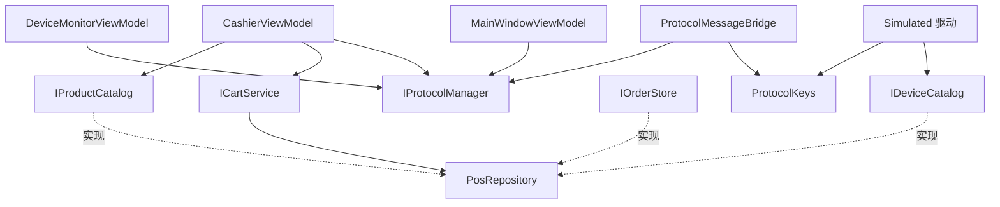

## Product Overview

对现有 WPF 项目「智汇 POS 收银终端」（CommunityToolkitDemo）做一次资深架构师级别的整体审查，从架构扩展性、可维护性、耦合性、安全性、代码简洁性、注释详细度六个维度给出评估结论，并针对每个具体问题给出可落地的优化方案。本次交付为「审查报告 + 优化方案」，不改动代码。

## Core Features

- 分维度架构评估：架构分层、扩展性、可维护性、耦合性、安全性、代码简洁性、注释与文档，各维度给出结论与依据（引用具体文件与行号）。
- 问题清单：按 P0（架构/耦合/扩展性）、P1（正确性/稳健性）、P2（重复代码/死代码/工程化）分级，每条包含「现象 + 影响 + 优化方案 + 向后兼容性说明」。
- 亮点确认：客观列出项目现有优秀实践，避免只列问题。
- 安全专章：异常信息外露、数据文件无大小上限、路径拼接安全性、凭据落盘、消息总线生命周期等逐条评估。
- 优化方案分批：按批次给出改造范围、涉及文件、实施顺序、风险与回滚点。
- 兼容性红线：明确「仅向后兼容」约束下禁止的改动，并将会改变可观察业务行为的项单列为「待确认行为变更」。

## Boundaries

- 本次不修改任何代码，只输出评估与优化建议；用户确认后再进入实施。
- 优化范围覆盖全量问题（含低优先级风格、命名、XML 文档、工程化配置）。
- 所有建议必须满足向后兼容：不修改、不删除现有公开接口成员与公开类型。

## 一、技术栈与基线（已核实）

- 目标框架：net10.0-windows，WPF，UseWPF=true，Nullable=enable，ImplicitUsings=enable，LangVersion=latest。
- 依赖：CommunityToolkit.Mvvm 8.4.2（ObservableObject / ObservableProperty / RelayCommand / Messenger / Ioc）、Microsoft.Extensions.DependencyInjection 10.0.12。
- 分层：Models / Messages / Protocols(含 Simulated 5 驱动) / Services / ViewModels / Views / Common(Styles、Converters、Controls、Behaviors)。
- 数据源：Data 目录下 4 个 Markdown 文件，按 PreserveNewest 复制到输出目录。
- 基线状态：全工程 lint（error+warning）为 0 诊断；无测试工程；无 README。
- 硬约束（用户已确认）：仅向后兼容。不得修改或删除 IProtocolManager、IProtocolDriver、ICartService、IOrderService、ISettingsService、IMarkdownDataService、IDialogService 的既有成员；不得删除现有公开类型与成员。允许新增接口、类型、常量、资源键；允许修改 internal/private 实现、DI 注册与 XAML。

## 二、审查结论（分维度）

| 维度 | 评价 | 核心结论 |
| --- | --- | --- |
| 架构分层 | 良好(B+) | 分层清晰、DI 集中注册且注释到位；但存在 3 处越层与反向依赖 |
| 扩展性 | 待改进(C+) | 驱动聚合设计优秀，但管理器承载业务语义且按 ProtocolType 硬编码查找，同类型多设备不可区分 |
| 可维护性 | 良好(B) | 注释优秀、性能细节到位；但存在上帝对象、过大 ViewModel 与重复映射 |
| 耦合性 | 待改进(C+) | ViewModel 直连仓储、Services 反向依赖 Simulated 具体驱动、驱动依赖仓储 |
| 安全性 | 良好(B) | 无真实网络通信、无凭据落盘；但异常信息外露、数据文件无大小上限 |
| 代码简洁 | 良好(B-) | 局部重复、1 处无效异常兜底、4 个未使用转换器 |
| 注释/文档 | 优秀(A-) | 中文详实、解释「为什么」；少量历史性/教学性注释与缺失的 param/returns 可规范 |


## 三、问题清单（含文件与行号）

### P0 高优先级：架构 / 耦合 / 扩展性

1. ViewModel 越过服务层直连仓储：ViewModels/CashierViewModel.cs:31,51,59 注入具体类 PosRepository，并在 :66,70,450,458,477 直接使用 _repository.CategoriesWithAll、_repository.Products、PosRepository.AllCategory；PosRepository 为 sealed 具体类且无接口。
2. 服务层反向依赖具体模拟驱动：Services/ProtocolMessageBridge.cs:6 引入 Protocols.Simulated，:55 使用 SerialPortSimDriver.BarcodeKey —— 桥接器（Services）依赖具体驱动（Protocols.Simulated），分层倒置。
3. 协议管理器承载业务语义 + 按类型硬编码：Protocols/IProtocolManager.cs:32-45 暴露 RequestBarcodeScanAsync、PushDisplayAmountAsync、OpenCashBoxAsync、PrintReceiptAsync、PublishOrderAsync；Protocols/ProtocolManager.cs:92-129 内含 SerialPortSimDriver.ScanCommand、AMT=、CASHBOX=OPEN、MQTT payload 等设备语义；Find(type) 位于 :174-175，只返回首个同类型驱动，SendToAsync 位于 :135-152 —— 新增第二台串口/第二块客显屏即失效。
4. 服务定位器反模式：ViewModels/MainWindowViewModel.cs:45 持有 IServiceProvider，:179 用 _services.GetService(viewModelType) 解析页面 VM。
5. 解析式副作用与 fire-and-forget 初始化：App.xaml.cs:41 仅为触发订阅而解析 ProtocolMessageBridge；:49 使用 _ = InitializeAsync()，异常仅 Debug.WriteLine（:70-73），失败对用户不可见。
6. PosRepository 上帝对象：Services/PosRepository.cs:13-102 同时承担商品/分类/设备/订单存储、CategoriesWithAll 视图构造（:70-81）、AddOrder 裁剪（:33-41）、GetDeviceOrDefault（:99-101）、条码/编码查找（:86-93）。
7. 传输层耦合数据层：5 个模拟驱动构造函数均接收 PosRepository，仅用于 GetDeviceOrDefault，如 ModbusTcpSimDriver.cs:18-21、SerialPortSimDriver.cs:24-28、OpcUaSimDriver.cs:15-18、SocketSimDriver.cs:19-22、MqttSimDriver.cs:13-16。
8. 集合封装泄漏：Protocols/ProtocolManager.cs:32 的 Drivers 直接暴露内部 List，调用方可向下转型后修改。

### P1 中优先级：正确性 / 稳健性

9. 索引与线性查找不一致：DeviceMonitorViewModel.cs:33 已建立 _cardIndex（:46-49 填充、:274 使用），但 ApplyDriverState 在 :313-321 仍使用 Cards.FirstOrDefault；MainWindowViewModel.cs:255 同样使用 FirstOrDefault。
10. 跨线程状态可见性：ProtocolDriverBase.cs:18 的 _state 非 volatile，:32-45 的 getter/setter 分别由后台循环线程与 UI 线程访问，StateChanged 在后台线程触发。
11. 并行任务写入非线程安全集合（脆弱）：MarkdownDataService.cs:20 的 List<string> _errors 在 :66,79 由 4 个并行 ReadAsync（:37-42）写入。当前因 LoadAsync 由 UI 线程调用、continuation 回到 UI 同步上下文而实际串行；一旦改由 Task.Run 或无同步上下文调用即产生竞态。
12. 无效的异常兜底：Views/DialogWindow.xaml.cs:138 使用 (Style)FindResource("WarningButton") 配合 ?? 回退 PrimaryButton —— FindResource 找不到键会抛 ResourceReferenceKeyNotFoundException 而非返回 null，回退永不生效（WarningButton 实际存在于 Common/Styles/Controls.xaml:248）。
13. IsMaxQuantity 语义不一致且未被使用：Models/CartItem.cs:37 为 Quantity 不小于 Product.Stock，未考虑 AllowOversell；而 Services/CartService.cs:23-24 在允许超卖时返回 int.MaxValue。grep 确认 IsMaxQuantity 在所有 XAML 中无绑定。
14. 零库存边界缺陷（当前数据未触发）：Services/CartService.cs:47 使用 Math.Clamp(quantity, 1, Math.Max(maxQuantity, 1))，当 Stock=0 且不允许超卖时仍会加入 1 件。Data/products.md 中无 Stock=0 记录，属未触发隐患。
15. 无 Dispatcher 时同步执行：Common/UiDispatcher.cs:22-27 在 Application.Current 为 null 时于调用线程直接执行 action，会掩盖「后台线程直改 UI」的问题。
16. 异常被全量吞掉：App.xaml.cs:141-146 弹出 e.Exception.Message 并统一设置 Handled=true，仅 Debug.WriteLine，无文件日志。
17. Task 结果取值风格：CashierViewModel.cs:329-331 在 Task.WhenAll 后使用 .Result 取值（成功路径无阻塞，属一致性问题）。

### P2 低优先级：重复逻辑 / 设计令牌 / 死代码 / 工程化

18. 重复映射逻辑三处：MainWindowViewModel.cs:241-249 的 ShortNameOf 与 Converters.cs:158-173 的 ProtocolTypeToShortTextConverter；DeviceCardViewModel.cs:61-67 的 StateText 与 Converters.cs:124-137；Order.cs:43-49 的 PaymentText 与 Converters.cs:240-253。
19. 转换器内硬编码 RGB 与设计令牌重复：Converters.cs:105-108、:268-271、:289-294 与 Common/Styles/Colors.xaml 的令牌重复。
20. 视图硬编码颜色绕过令牌：Views/MainWindow.xaml:82,105,166,188,192,216,219；Views/CashierView.xaml:407,411；Views/DialogWindow.xaml:47。对应令牌已存在：NavBackgroundAltBrush(:21)、NavHoverBrush(:22)、TextSecondaryBrush(:26)、TextMutedBrush(:27)、TextOnDarkMutedBrush(:29)、DividerBrush(:44)、PrimaryLightBrush(:12)；遮罩色无令牌。
21. 未使用的公开转换器（死代码）：EqualityToBooleanConverter（Converters.cs:176-195）、InverseBooleanConverter（:71-78）、TimeTextConverter（:230-237）、PaymentMethodToTextConverter（:240-253），全量 XAML grep 无引用。
22. CashierViewModel 过大：ViewModels/CashierViewModel.cs 共 546 行，单类承担浏览、过滤、防抖、扫码加购、结算校验、外设编排（:296-359）与结果拼装（:532-543）。
23. VM 冗余透传状态：CashierViewModel.cs:101-167 的 Total/ItemCount/KindCount/HasItems 从 _cart 重复计算并由 NotifyCartChanged()（:520-529）手工逐一通知，而 CartChangedMessage 已携带 CartSummary。
24. 工程化缺口：CommunityToolkitDemo.csproj:20-21 关闭 EnforceCodeStyleInBuild 与 GenerateDocumentationFile；无单元测试工程。

### 安全专章（均为低风险）

25. 异常信息直接展示给用户：App.xaml.cs:144。
26. 数据文件无大小上限：Services/MarkdownDataService.cs:70 一次性读入，超大文件可致内存膨胀。
27. DialogWindow.Owner 可能为 null：Views/DialogWindow.xaml.cs:99，仅影响模态归属与居中。
28. 已确认无路径遍历风险：路径为 AppContext.BaseDirectory 加常量文件名（MarkdownDataService.cs:14-17,25,60）。

## 四、优化方案（分批，全部向后兼容）

### 批次 A：P0 结构性解耦（不改任何现有接口成员）

- A1：新增只读接口 Services/IProductCatalog.cs（CategoriesWithAll、Products、FindByBarcode、FindByCode、AllCategoryId），由 PosRepository 直接实现（声明处追加 implements，不删除其任何现有成员）；CashierViewModel 构造参数由 PosRepository 改为 IProductCatalog；DI 中以 AddSingleton 将接口映射到同一 PosRepository 单例，保证单实例语义不变。
- A2：新增协议中立常量 Protocols/ProtocolKeys.cs（Barcode、ScanCommand 等）；SerialPortSimDriver.BarcodeKey 保留并赋值为该常量；ProtocolMessageBridge 改用中立常量并移除对 Protocols.Simulated 的引用，消除服务层反向依赖。
- A3：设备与协议查找统一走索引：DeviceMonitorViewModel.ApplyDriverState 改用 _cardIndex；MainWindowViewModel 新增 Dictionary 索引替代 ProtocolStatuses.FirstOrDefault。
- A4：ProtocolDriverBase.State 使用 Volatile.Read/Volatile.Write 访问 _state，修正跨线程可见性。
- A5：MarkdownDataService 错误汇总线程安全化（ReadAsync 返回结果对象后统一汇总，或对 _errors 加锁），保持 LoadErrors 语义与顺序稳定。
- A6：DialogWindow 按钮样式改用 TryFindResource 并保留中性色兜底，移除永不生效的回退表达式。
- A7：App 显式持有 ProtocolMessageBridge 字段（消除纯副作用解析）；初始化失败经 StatusNotificationMessage 上报到全局提示条，Debug 记录保留。
- A8：可选分段接口 IDeviceCatalog（GetDeviceOrDefault），由 PosRepository 实现，5 个模拟驱动改为依赖该接口，解除传输层对仓储的耦合。

### 批次 B：P1/P2 正确性与可维护性

- B1：抽取共享映射 Models/ProtocolDisplay.cs（协议短名/全名、连接状态文本、支付方式文本），ViewModel 与 Converter 共用，删除三处重复 switch。
- B2：设计令牌统一：MainWindow.xaml 与 CashierView.xaml 的硬编码色替换为 StaticResource；Colors.xaml 新增 DialogMaskBrush（值 #730F172A）；转换器内 RGB 尽量以令牌语义表达，保持视觉零变化。
- B3：CashierViewModel 透传属性改为基于缓存 CartSummary 计算并集中通知，减少对 _cart 的重复读取。
- B4：ProtocolManager.Drivers 改为返回只读包装，避免内部集合外泄。
- B5：UiDispatcher.Post 在无 Application 时行为明确化（记录后丢弃或使用 Dispatcher.CurrentDispatcher），避免静默在后台线程改 UI。
- B6：CashierViewModel 结算编排抽取内部协作者（保持命令名与 XAML 绑定路径不变），降低单类复杂度。
- B7：PosRepository 按最小接口分段暴露（IProductCatalog / IOrderStore / IDeviceCatalog），调用方依赖最小契约。

### 批次 C：低优先级规范与工程化

- C1：命名与注释规范化（如 ShortNameOf 改为更明确的名称），精简历史性注释，补全缺失的 param/returns。
- C2：工程化配置：GenerateDocumentationFile=true（配合 NoWarn 控制未注释公开成员告警），可选 TreatWarningsAsErrors；新增 CommunityToolkitDemo.Tests（xUnit）覆盖 MarkdownTableParser、CartService 上限逻辑、ProtocolDriverBase 状态机与 Converters。
- C3：Task.WhenAll 结果统一改为返回数组后取值，去掉 .Result。
- C4：OnDispatcherUnhandledException 增加文件日志并区分致命/非致命，谨慎评估 Handled 策略。
- C5：MarkdownDataService 增加数据文件大小上限校验（安全加固）。

## 五、兼容性红线与待确认项

- 红线：不得修改或删除 7 个既有接口的任何成员；不得删除现有公开类型与成员（含 4 个未使用转换器，清理需单独确认）。
- 待确认行为变更（不在默认实施范围，需用户拍板）：其一，CartItem.IsMaxQuantity 与 AllowOversell 语义对齐；其二，CartService 零库存商品不得加入购物车。

## 六、架构设计（改造后依赖方向）



要点：表现层只依赖接口；桥接器不再依赖具体模拟驱动；驱动只依赖设备配置接口而非整个仓储；PosRepository 保持唯一数据落点不变。

## 七、目录结构（新增与修改清单）

```
CommunityToolkitDemo/
├── docs/
│   └── 架构审查报告.md                    # [NEW] 分维度审查结论、P0/P1/P2 问题清单、批次方案、验收标准
├── Services/
│   ├── IProductCatalog.cs                 # [NEW] 商品目录只读契约，由 PosRepository 实现，供 CashierViewModel 依赖
│   ├── IDeviceCatalog.cs                  # [NEW] 设备配置只读契约（批次 A8），供协议驱动依赖
│   ├── IOrderStore.cs                     # [NEW] 订单只读契约（批次 B7），按需引入
│   ├── PosRepository.cs                   # [MODIFY] 追加接口实现声明；保持全部现有成员与语义不变
│   ├── ProtocolMessageBridge.cs           # [MODIFY] 移除对 Protocols.Simulated 的依赖，改用 ProtocolKeys
│   └── MarkdownDataService.cs             # [MODIFY] 错误汇总线程安全化；新增文件大小上限校验
├── Protocols/
│   ├── ProtocolKeys.cs                    # [NEW] 协议中立常量（Barcode、ScanCommand 等）
│   ├── ProtocolManager.cs                 # [MODIFY] Drivers 返回只读包装
│   ├── ProtocolDriverBase.cs              # [MODIFY] State 采用 Volatile 读写
│   └── Simulated/*.cs                     # [MODIFY] 构造依赖改为 IDeviceCatalog；BarcodeKey 复用 ProtocolKeys
├── ViewModels/
│   ├── CashierViewModel.cs                # [MODIFY] 依赖 IProductCatalog；透传属性基于 CartSummary；结算编排抽取
│   ├── DeviceMonitorViewModel.cs          # [MODIFY] ApplyDriverState 改用 _cardIndex
│   └── MainWindowViewModel.cs             # [MODIFY] 状态项改字典索引；页签解析相关清理
├── Models/
│   ├── ProtocolDisplay.cs                 # [NEW] 共享显示映射（协议/状态/支付方式文本）
│   └── CartItem.cs                        # [MODIFY] 待确认：IsMaxQuantity 语义对齐
├── Views/
│   ├── MainWindow.xaml                    # [MODIFY] 硬编码色替换为设计令牌
│   ├── CashierView.xaml                   # [MODIFY] 硬编码色替换为设计令牌
│   ├── DialogWindow.xaml                  # [MODIFY] 遮罩色改用 DialogMaskBrush
│   └── DialogWindow.xaml.cs               # [MODIFY] 按钮样式改用 TryFindResource
├── Common/
│   ├── UiDispatcher.cs                    # [MODIFY] 无 Dispatcher 时行为明确化
│   ├── Converters/Converters.cs           # [MODIFY] 复用共享映射与令牌语义
│   └── Styles/Colors.xaml                 # [MODIFY] 新增 DialogMaskBrush 令牌
├── App.xaml.cs                            # [MODIFY] 显式持有桥接器；初始化异常上报 UI；DI 注册最小接口映射
├── CommunityToolkitDemo.csproj            # [MODIFY] 开启文档生成、补充分析器配置
└── tests/
    └── CommunityToolkitDemo.Tests/        # [NEW] xUnit 测试工程，覆盖解析器、购物车上限、驱动状态机、转换器
```

## 八、关键代码结构（新增契约，仅接口级）

```
// Services/IProductCatalog.cs —— 由 PosRepository 实现；不改变其任何现有公开成员
public interface IProductCatalog
{
    IReadOnlyList<ProductCategory> CategoriesWithAll { get; }
    List<Product> Products { get; }
    Product? FindByBarcode(string barcode);
    Product? FindByCode(string code);
    string AllCategoryId { get; }
}

// Protocols/ProtocolKeys.cs —— 协议中立常量，供桥接器与串口驱动共用，解除反向依赖
public static class ProtocolKeys
{
    public const string Barcode = "条码";
    public const string ScanCommand = "TRIGGER_SCAN";
}
```

## 九、验收方式

- 每批次结束执行 dotnet build 与全工程 lint，要求 0 error、0 warning。
- 非行为变更批次需保证 UI 视觉与交互完全一致（B2 需逐色比对）。
- 涉及删除公开成员或改变业务行为的项（B3 清理、IsMaxQuantity、零库存）单列并请用户确认后再实施。
- 新增测试工程需全部通过。

## Agent Extensions

### SubAgent

- **code-explorer**
- Purpose: 在编写审查报告前复核各问题的调用链与影响面（如谁使用 PosRepository、谁引用被改动的驱动与转换器），确保报告中的文件与行号定位准确、无遗漏调用点。
- Expected outcome: 产出「问题点 -> 引用位置 -> 影响面 -> 兼容性风险」的复核清单，作为报告问题清单与批次划分的依据。

### Skill

- **lsp-code-analysis**
- Purpose: 使用 LSP 语义能力做影响分析（find references / implementations / call hierarchy），核对新增接口映射与内部改动是否触碰任何公开成员的使用方。
- Expected outcome: 确认批次 A 至 C 的改动均不破坏现有公开接口调用方，输出无破坏性影响的验证结论。