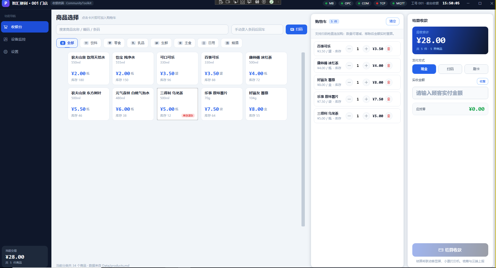
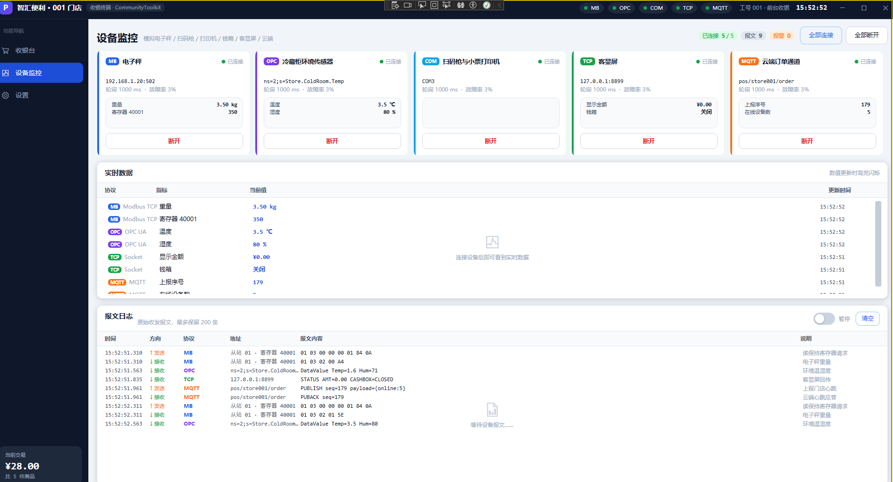
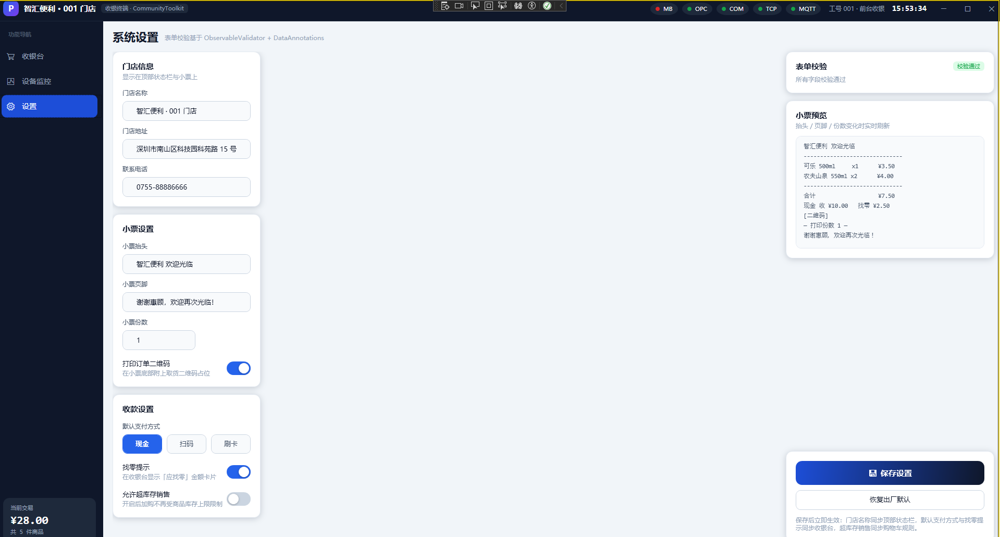

# 01 · 项目全貌与一次扫码的完整旅程

> 《我是如何构建 WPF 项目》系列 · 第 01 篇
> 上一篇：[系列导读](00-系列导读.md) ｜ 下一篇：[CommunityToolkit.Mvvm 知识点逐个拆](02-CommunityToolkit.Mvvm-知识点逐个拆.md)

---

## 一、写在前面：我为什么要用这个项目学 WPF

刚接触 WPF 的时候，我是懵的。

WinForm 那套我很熟：拖一个 `Button`，双击生成 `OnClick`，在事件里写业务代码，完事。到了 WPF，教程一上来就跟我讲 XAML、依赖属性、附加属性、数据绑定、路由事件、视觉树、逻辑树……名词一个比一个唬人，看了三天，我连"为什么按钮点了没反应"都搞不明白。

后来我才慢慢想通一件事：**WPF 真正难的不是语法，而是"思路要换"**。

| | WinForm 的思路 | WPF 的思路 |
| --- | --- | --- |
| 核心动作 | 我要**操作控件** | 我要**描述状态** |
| 例子 | `textBox1.Text = "hello"` | 我把数据改掉，界面自己跟着变 |
| 关键概念 | 事件驱动 | 数据绑定（Data Binding） |

这个转变的关键词，叫 **数据绑定**；而把数据组织好、让界面能干净地跟着变的那套写法，叫 **MVVM**。

可问题又来了：教程里的 MVVM 例子永远是"一个文本框 + 一个按钮 + 一句 Hello World"。看完我懂了，但一放到真实项目里又不会了——真实项目里有登录、有列表、有分页、有后台线程、有硬件通信、有页面切换、有全局提示……这些东西教程不讲。

于是我做了一件很"笨"但事后看来最有效的事：**找一个真实的业务场景，把 MVVM 的每个知识点都塞进去，让它必须被用上。**

我选的场景是：**便利店收银台（POS）**。

为什么是 POS？因为它天然包含了几乎所有值得练的东西：

| 收银台的真实需求 | 对应的 WPF / MVVM 知识点 |
| --- | --- |
| 商品列表、分类筛选、搜索 | 集合绑定、`ObservableCollection`、UI 虚拟化 |
| 购物车加减、金额联动 | `[ObservableProperty]`、`[NotifyPropertyChangedFor]` |
| 结算按钮"该亮才亮" | `[RelayCommand]` + `CanExecute` |
| 页面之间传递"购物车变了" | 消息总线 `IMessenger` |
| 扫码枪、打印机、钱箱 | 后台线程 + 硬件协议抽象 |
| 设备状态灯、实时数据刷新 | 线程切回 UI、批量刷新 |
| 门店设置、小票提示 | 依赖注入、单例服务 |

一个收银台，把我想学的东西全串起来了。

这个项目就是 **`CommunityToolkitDemo`（产品名"智汇 POS 收银终端"）**。下面我从"它长什么样"开始，一层层拆给你看。

---

## 二、这个项目是什么

### 2.1 一句话介绍

**它是一个用 WPF + `CommunityToolkit.Mvvm` 写的便利店收银台演示程序：能浏览商品、加购物车、结算支付，并且模拟对接了 5 种硬件通信协议。**

技术栈非常克制，就两个 NuGet 包：

```xml
<!-- CommunityToolkitDemo/CommunityToolkitDemo.csproj:31-36 -->
<ItemGroup>
  <!-- MVVM 唯一必需包：ObservableObject / ObservableProperty / RelayCommand / Messenger / Ioc -->
  <PackageReference Include="CommunityToolkit.Mvvm" Version="8.4.2" />
  <!-- 依赖注入容器（配合 CommunityToolkit.Mvvm.DependencyInjection.Ioc 使用） -->
  <PackageReference Include="Microsoft.Extensions.DependencyInjection" Version="10.0.12" />
</ItemGroup>
```

目标框架：

```xml
<!-- CommunityToolkitDemo/CommunityToolkitDemo.csproj:4-11 -->
<OutputType>WinExe</OutputType>
<TargetFramework>net10.0-windows</TargetFramework>
<UseWPF>true</UseWPF>
<Nullable>enable</Nullable>
<ImplicitUsings>enable</ImplicitUsings>
```

注意三个细节，都是刻意选的：

1. **`WinExe` + `net10.0-windows`**：它只能在 Windows 上跑的桌面程序，不是类库。
2. **`Nullable enable`**：开启可空引用类型检查。这在 WPF 里特别值钱，因为绑定出错的时候，`null` 是万恶之源。
3. **依赖只有两个包**：没有 Prism、没有 MahApps、没有 HandyControl。我想先把"原生 WPF + 官方 MVVM 工具包"这条路走通，而不是一上来就被框架的约定淹没。

### 2.2 它有三个页面

主窗口是一个典型的"上标题栏 + 左导航 + 右内容区 + 底提示条"的后台管理布局：

```
┌────────────────────────────────────────────────────────────┐
│  [P] 智汇便利 · 001 门店   ●  ●  ●  ●  ●      工号 001  10:24 │  ← 标题栏（含 5 个协议状态灯）
├──────────┬─────────────────────────────────────────────────┤
│ 功能导航 │                                                  │
│  收银台  │                                                  │
│ 设备监控 │              内容区（CurrentViewModel）           │
│   设置   │                                                  │
│          │                                                  │
│ 当前交易 │                                                  │
│  ¥ 12.50 │                                                  │
│  共 2 件 │                                                  │
├──────────┴─────────────────────────────────────────────────┤
│ ● 就绪 · 请选择商品开始收银              2026年09月14日 星期一 │  ← 底部提示条
└────────────────────────────────────────────────────────────┘
```

三个页面分别是：

- **收银台（`CashierView`）**：商品卡片墙 + 分类标签 + 搜索框 + 购物车 + 结算面板。



- **设备监控（`DeviceMonitorView`）**：5 张设备卡片（Modbus / OPC UA / 串口 / Socket / MQTT），每张卡片有连接开关；下面是聚合的实时数据表、报警条和报文日志。



- **设置（`SettingsView`）**：门店名称、是否允许超卖、是否显示找零提示、默认支付方式等。



这个"外壳"的 XAML 就是主窗口：

```xml
<!-- CommunityToolkitDemo/Views/MainWindow.xaml:54-59 -->
<Grid>
    <Grid.RowDefinitions>
        <RowDefinition Height="48" />   <!-- 标题栏 -->
        <RowDefinition Height="*" />     <!-- 主体 -->
        <RowDefinition Height="Auto" />  <!-- 底部提示条 -->
    </Grid.RowDefinitions>
```

主体部分左边是导航、右边是内容：

```xml
<!-- CommunityToolkitDemo/Views/MainWindow.xaml:150-154 -->
<Grid Grid.Row="1">
    <Grid.ColumnDefinitions>
        <ColumnDefinition Width="206" />
        <ColumnDefinition Width="*" />
    </Grid.ColumnDefinitions>
```

而右侧内容区只有**一行**代码：

```xml
<!-- CommunityToolkitDemo/Views/MainWindow.xaml:202-205 -->
<!-- 内容区：CachedContentControl + 隐式 DataTemplate 自动匹配 View（并缓存复用视图） -->
<Border Grid.Column="1" Background="{StaticResource AppBackgroundBrush}">
    <controls:CachedContentControl Content="{Binding CurrentViewModel}" />
</Border>
```

我第一次看到这里的时候愣了半天：**三个页面，怎么只有一行？**

答案就在 `App.xaml` 里的"隐式 DataTemplate"：

```xml
<!-- CommunityToolkitDemo/App.xaml:13-28 -->
<!-- ==========================================================
     隐式 DataTemplate：ViewModel 类型 → View
     ContentControl 绑定 CurrentViewModel 时会自动挑选对应视图，
     这就是"模块化拆分 + 零代码页面切换"的关键。
     ========================================================== -->
<DataTemplate DataType="{x:Type vm:CashierViewModel}">
    <views:CashierView />
</DataTemplate>

<DataTemplate DataType="{x:Type vm:DeviceMonitorViewModel}">
    <views:DeviceMonitorView />
</DataTemplate>

<DataTemplate DataType="{x:Type vm:SettingsViewModel}">
    <views:SettingsView />
</DataTemplate>
```

**这是我认为 WPF 最优雅的设计之一**，值得停下来讲一遍：

- `DataTemplate` 的 `DataType` 写的是 **ViewModel 的类型**，不是控件的类型。
- 当 `ContentControl.Content` 被赋了一个 `CashierViewModel` 对象时，WPF 会自动去找"谁能渲染 `CashierViewModel`"，于是挑中第一个模板，生成 `CashierView`。
- 所以"切换页面"这件事，在代码里只需要改一个属性：`CurrentViewModel = 另一个ViewModel`。

**界面长什么样，完全由"当前是哪个 ViewModel"决定**——这就是 MVVM 的味道。

> 关于那个 `CachedContentControl`（为什么不用原生 `ContentControl`），第 03 篇和第 04 篇会专门讲，它是这个项目 UI 性能优化的关键之一。

### 2.3 它是怎么启动的

有意思的是，`App.xaml` 里**没有 `StartupUri`**。也就是说，程序不是自动打开某个窗口的，而是我们自己接管了启动流程：

```xml
<!-- CommunityToolkitDemo/App.xaml:1-11 -->
<Application x:Class="CommunityToolkitDemo.App"
             xmlns="http://schemas.microsoft.com/winfx/2006/xaml/presentation"
             xmlns:x="http://schemas.microsoft.com/winfx/2006/xaml"
             xmlns:vm="clr-namespace:CommunityToolkitDemo.ViewModels"
             xmlns:views="clr-namespace:CommunityToolkitDemo.Views">
    <Application.Resources>
        <ResourceDictionary>
            <ResourceDictionary.MergedDictionaries>
                <!-- Controls 已内部合并 Colors，形成单一资源链 -->
                <ResourceDictionary Source="/CommunityToolkitDemo;component/Common/Styles/Controls.xaml" />
            </ResourceDictionary.MergedDictionaries>
```

启动逻辑全在 `App.xaml.cs`：

```csharp
// CommunityToolkitDemo/App.xaml.cs:41-63
protected override void OnStartup(StartupEventArgs e)
{
    base.OnStartup(e);

    DispatcherUnhandledException += OnDispatcherUnhandledException;

    var services = new ServiceCollection();
    ConfigureServices(services);

    Services = services.BuildServiceProvider();
    Ioc.Default.ConfigureServices(Services);

    // 启动即建立桥接：构造时订阅协议事件，此后条码扫描/设备报警才能转成全局消息。
    _bridge = Services.GetRequiredService<ProtocolMessageBridge>();

    // 先显示窗口，再做数据加载与设备连接：
    // 替换旧的 sync-over-async（GetAwaiter().GetResult()）写法，避免阻塞 UI 线程导致启动白屏。
    var window = Services.GetRequiredService<MainWindow>();
    window.DataContext = Services.GetRequiredService<MainWindowViewModel>();
    window.Show();

    _ = InitializeAsync();
}
```

这段代码里有 **4 个我认为很值钱的小设计**，我逐条解释一下（都是踩过坑才改成这样的）：

**① 先 `window.Show()`，再异步加载数据。**

老代码是 `GetAwaiter().GetResult()` 同步等数据加载完，结果数据量大一点，用户就看到一片白屏。现在改成"窗口先出现，数据后台加载完再广播消息刷新界面"。

**② `_ = InitializeAsync();` 是"发起但不等待"。**

下划线 `_` 是"我明确知道这是个 fire-and-forget 任务"的写法。但 fire-and-forget 最怕异常被静默吞掉，所以 `InitializeAsync` 内部整体包了 `try/catch`：

```csharp
// CommunityToolkitDemo/App.xaml.cs:69-91
private static async Task InitializeAsync()
{
    try
    {
        var dataService = Services.GetRequiredService<IMarkdownDataService>();
        await dataService.LoadAsync();

        // 数据就绪广播：页面据此刷新（如收银台重建分类 / 商品视图）
        Services.GetRequiredService<IMessenger>().Send(new DataLoadedMessage(
            new DataLoaded(dataService.LoadErrors.Count == 0, dataService.LoadErrors.ToArray(), DateTime.Now)));

        // 数据就绪后再连接设备（驱动会按仓储中的设备配置建立会话）
        await Services.GetRequiredService<IProtocolManager>().ConnectAllAsync();
    }
    catch (Exception ex)
    {
        Debug.WriteLine($"[启动] 初始化失败：{ex}");
        NotifyStatus($"应用初始化失败，部分数据可能不可用：{ex.Message}", StatusNotificationMessage.StatusLevel.Error);
    }
}
```

**③ `ProtocolMessageBridge` 用字段存着，而不是"用完就扔"。**

这是一个特别容易犯的错——它的作用全在构造函数里的"订阅"副作用上，如果你写成 `_ = Services.GetRequiredService<ProtocolMessageBridge>();`，读代码的人很可能以为这是废代码顺手删掉，然后扫码功能就莫名失灵了。项目里专门写了注释说明：

```csharp
// CommunityToolkitDemo/App.xaml.cs:31-39
/// <summary>
/// 协议消息桥接器（协议事件 → 全局消息）。
/// </summary>
/// <remarks>
/// 必须在启动时创建并保持存活：它只有在构造函数中订阅了协议事件之后才能工作。
/// 之前这里用"解析后丢弃返回值"的方式触发副作用，读代码的人很容易误以为是无用代码而删掉；
/// 改为字段持有后，生命周期一目了然。
/// </remarks>
private ProtocolMessageBridge? _bridge;
```

**④ 退出时按顺序清理。**

单例对象不释放，事件订阅会一直挂着，程序看起来关了但资源还在——这类问题在长时间运行的程序里很要命：

```csharp
// CommunityToolkitDemo/App.xaml.cs:104-129
protected override void OnExit(ExitEventArgs e)
{
    // 先退订协议事件（Dispose 幂等，容器随后还会再释放一次，重复调用安全）
    _bridge?.Dispose();
    _bridge = null;

    // 再断开全部协议驱动（优雅停止后台仿真循环），最后释放容器内所有单例
    if (Services.GetService<IProtocolManager>() is { } manager)
    {
        try
        {
            manager.DisconnectAllAsync().GetAwaiter().GetResult();
        }
        catch (Exception ex)
        {
            Debug.WriteLine($"[退出] 断开协议失败：{ex.Message}");
        }
    }

    // 释放主窗口/页面 ViewModel：退订事件、停止计时器、注销消息订阅
    (Services.GetService<MainWindowViewModel>() as IDisposable)?.Dispose();

    // 释放实现了 IDisposable 的服务（协议管理器 / 各驱动等）
    (Services as IDisposable)?.Dispose();
    base.OnExit(e);
}
```

另外还接管了"UI 线程未处理异常"：

```csharp
// CommunityToolkitDemo/App.xaml.cs:193-210
private void OnDispatcherUnhandledException(object sender, DispatcherUnhandledExceptionEventArgs e)
{
    Debug.WriteLine($"[UI 未处理异常] {e.Exception}");

    // 详情落盘、界面只给可读文案：
    // 直接把 Exception.Message 弹给用户既可能暴露内部实现细节，也无法留存现场供后续排查。
    var logPath = AppendErrorLog(e.Exception);

    MessageBox.Show(
        logPath is null
            ? "操作未能完成，请重试。"
            : $"操作未能完成，请重试。\n\n错误详情已记录到：\n{logPath}",
        "系统提示",
        MessageBoxButton.OK,
        MessageBoxImage.Warning);

    e.Handled = true;
}
```

这里的 `e.Handled = true;` 意思是"这个异常我处理了，别再弹那个经典的红叉崩溃框了"。而 `AppendErrorLog` 内部还有一条铁律：

```csharp
// CommunityToolkitDemo/App.xaml.cs:212-218
/// <remarks>
/// 这里绝不能向外抛异常：否则会在未处理异常处理器内部再产生一个未处理异常，
/// 造成递归崩溃（表现为进程直接退出、看不到任何提示）。
/// </remarks>
```

**记住这条：全局异常处理器里绝对不能自己抛异常。** 我在项目里踩过一次，现象是"程序直接消失、什么都不提示"，查了很久才明白是递归崩溃。

---

## 三、整体架构：分层到底分了什么

### 3.1 目录结构

整个项目按"职责"分目录，我把它和"对应知识点"一起列出来：

```
CommunityToolkitDemo/
├── App.xaml / App.xaml.cs      # 入口：DI 容器装配、启动/退出、全局异常
├── Models/                     # 纯数据模型
│   ├── Product.cs              #   商品、商品分类
│   ├── CartItem.cs             #   购物车行项（含 MaxQuantity / IsMaxQuantity）
│   ├── Order.cs                #   订单、订单明细、支付方式枚举
│   ├── PosSettings.cs          #   门店设置
│   ├── DeviceInfo.cs           #   设备配置
│   └── ProtocolFrame.cs / ProtocolType.cs / ProtocolDisplay.cs
├── Services/                   # 业务服务（界面无关，可单测）
│   ├── CartService.cs          #   购物车：增删改 + 广播变更
│   ├── CartLimits.cs           #   数量上限规则（单一事实来源）
│   ├── OrderService.cs         #   生成订单、落库
│   ├── ProductQueryService.cs  #   商品查询：分类切片 + 关键字过滤 + 结果上限
│   ├── PosRepository.cs        #   内存仓储：全应用唯一数据落点
│   ├── MarkdownDataService.cs  #   把 Markdown 表格当数据源加载
│   ├── CheckoutCoordinator.cs  #   结算外设编排：打印 / 开钱箱 / 上报
│   ├── ProtocolMessageBridge.cs#   协议事件 → 全局消息
│   └── SettingsService.cs / DialogService.cs
├── Protocols/                  # 硬件通信抽象（策略模式 + 模板方法）
│   ├── IProtocolDriver.cs      #   驱动契约
│   ├── ProtocolDriverBase.cs   #   驱动基类：轮询循环 + 请求应答
│   ├── ProtocolManager.cs      #   聚合管理全部驱动
│   ├── ProtocolKeys.cs         #   协议中立常量（条码、开钱箱、客显）
│   └── Simulated/              #   5 个模拟驱动
├── ViewModels/                 # 表现层逻辑（每个页面一个 VM）
│   ├── MainWindowViewModel.cs  #   外壳：导航、状态栏、时钟
│   ├── CashierViewModel.cs     #   收银台
│   ├── DeviceMonitorViewModel.cs#  设备监控
│   ├── DeviceCardViewModel.cs  #   单张设备卡片
│   ├── SettingsViewModel.cs    #   设置
│   ├── LiveMetricItem.cs       #   一条实时指标
│   ├── NavItem.cs / ProtocolStatusItem.cs
├── Views/                      # 只有 XAML 和少量纯 UI 相关 code-behind
├── Messages/                   # 9 个强类型消息定义
├── Common/                     # 可复用基础设施
│   ├── UiDispatcher.cs         #   后台线程 → UI 线程
│   ├── Controls/               #   VirtualizingWrapPanel、CachedContentControl
│   ├── Collection/             #   RangeObservableCollection（批量通知）
│   ├── Behaviors/AttachedProps.cs # 5 个附加属性
│   ├── Converters/Converters.cs   # 值转换器
│   └── Styles/                 #   颜色令牌、控件样式
├── Data/                       # Markdown 数据源（products / categories / devices / orders）
└── tests/CommunityToolkitDemo.Tests/  # xUnit 测试工程
```

### 3.2 依赖方向：谁可以认识谁

分层最核心的问题不是"分了几个文件夹"，而是 **"谁能引用谁"**。这个项目的规则是一条单向线：

```
    Views（XAML）
        │ 只通过 数据绑定 + ICommand 交互，不 new ViewModel
        ▼
    ViewModels（表现层逻辑）
        │ 只依赖 Services / Protocols 的【接口】
        ▼
    Services / Protocols（业务与通信）
        │ 依赖仓储接口、消息总线
        ▼
    PosRepository（数据落点）
        │
        ▼
    Models（纯数据）/ Data（Markdown 文件）
```

我举一个最能说明问题的例子——**收银台 ViewModel 的构造函数**：

```csharp
// CommunityToolkitDemo/ViewModels/CashierViewModel.cs:31-44
/// <summary>
/// 商品目录（只读契约）：收银台只需要"看商品/分类"，不需要订单与设备能力，
/// 因此依赖最小接口而非整个仓储，避免表现层被数据层实现细节绑定。
/// </summary>
private readonly IProductCatalog _catalog;

private readonly ICartService _cart;
private readonly IOrderService _orders;
private readonly IDialogService _dialogs;
private readonly IProtocolManager _protocols;
private readonly ISettingsService _settings;

/// <summary>结算外设编排（打印/开钱箱/上报）：设备协调细节不放在本类</summary>
private readonly CheckoutCoordinator _checkoutCoordinator;
```

看到没有：**全是接口**（`IProductCatalog`、`ICartService`、`IOrderService`……），没有一个是具体类。

更妙的是那个 `IProductCatalog`。仓储 `PosRepository` 其实什么都有——商品、设备、订单：

```csharp
// CommunityToolkitDemo/Services/PosRepository.cs:13
public sealed class PosRepository : IProductCatalog, IDeviceCatalog
```

但收银台拿到的**只是 `IProductCatalog`**——它只能看到商品和分类，连设备都摸不到。这叫**接口隔离**：给你刚好够用的能力，不多给。

而 DI 容器里注册的写法是：

```csharp
// CommunityToolkitDemo/App.xaml.cs:138-147
// ---------- 数据访问层 ----------
services.AddSingleton<PosRepository>();

// 仓储按"最小契约"对外暴露：调用方只依赖自己真正需要的能力（商品目录 / 设备配置），
// 而不是拿到包含订单在内的整个仓储。两个接口都解析到同一个 PosRepository 单例，
// 因此"全应用唯一数据落点"的既有语义完全不变。
services.AddSingleton<IProductCatalog>(sp => sp.GetRequiredService<PosRepository>());
services.AddSingleton<IDeviceCatalog>(sp => sp.GetRequiredService<PosRepository>());

services.AddSingleton<IMarkdownDataService, MarkdownDataService>();
```

**两个接口解析到同一个实例**，所以"全应用只有一份数据"这个语义没变，但每个调用方只能看见自己该看见的那部分。

### 3.3 DI 装配：注册顺序就是依赖顺序

`ConfigureServices` 是整个项目的"接线图"，我按注释分块看一下：

```csharp
// CommunityToolkitDemo/App.xaml.cs:132-191（节选）
private static void ConfigureServices(IServiceCollection services)
{
    // ---------- 基础设施 ----------
    // 全局消息总线：整个应用共用同一个 WeakReferenceMessenger 实例
    services.AddSingleton<IMessenger>(_ => WeakReferenceMessenger.Default);

    // ---------- 通信层（模拟协议驱动） ----------
    // 每种协议注册为 IProtocolDriver：新增协议只需在此追加一行，ProtocolManager 无需改动。
    services.AddSingleton<IProtocolDriver, ModbusTcpSimDriver>();
    services.AddSingleton<IProtocolDriver, OpcUaSimDriver>();
    services.AddSingleton<IProtocolDriver, SerialPortSimDriver>();
    services.AddSingleton<IProtocolDriver, SocketSimDriver>();
    services.AddSingleton<IProtocolDriver, MqttSimDriver>();

    // 协议管理器：构造时注入 IEnumerable<IProtocolDriver> 聚合全部驱动
    services.AddSingleton<IProtocolManager, ProtocolManager>();

    // ---------- 业务服务层 ----------
    services.AddSingleton<IProductQuery, ProductQueryService>();

    // 均为单例：购物车、订单、门店设置需要在页面切换间保持状态
    services.AddSingleton<ISettingsService, SettingsService>();
    services.AddSingleton<ICartService, CartService>();
    services.AddSingleton<IOrderService, OrderService>();
    services.AddSingleton<IDialogService, DialogService>();

    // ---------- 窗口 / 页面 ViewModel ----------
    services.AddSingleton<MainWindow>();

    // 页面解析器：把"按类型取页面 ViewModel"收窄为一个委托，
    // 使 MainWindowViewModel 不必依赖整个 IServiceProvider（服务定位器反模式）。
    services.AddSingleton<Func<Type, ObservableObject?>>(
        sp => type => sp.GetService(type) as ObservableObject);

    // 页面 ViewModel 使用单例，切换页面时保留状态（购物车、日志等）
    services.AddSingleton<MainWindowViewModel>();
    services.AddSingleton<CashierViewModel>();
    services.AddSingleton<DeviceMonitorViewModel>();
    services.AddSingleton<SettingsViewModel>();
}
```

这里有三个我要特别指出的设计取舍，都是"从坏到好"改出来的：

**取舍一：为什么注册 5 个 `IProtocolDriver` 就能自动聚合？**

因为 `ProtocolManager` 的构造函数要的是 `IEnumerable<IProtocolDriver>`，DI 容器会把注册的 5 个实现全部塞给它。**所以"新增一种协议"只需要在注册表里加一行，`ProtocolManager` 一个字都不用改**——这是依赖注入最实用的价值。

**取舍二：为什么不用 `Ioc.Default.GetService<T>()` 满天飞？**

`Ioc.Default.ConfigureServices(Services)` 确实让"任何地方都能取到服务"变得很方便。但项目注释里写得很直白：

```csharp
// CommunityToolkitDemo/App.xaml.cs:19-25
/// <summary>
/// 应用入口：负责搭建依赖注入容器并初始化 CommunityToolkit 的 Ioc。
///
/// 知识点：CommunityToolkit.Mvvm.DependencyInjection.Ioc.Default.ConfigureServices
/// 让整个应用可以直接通过 Ioc.Default.GetService&lt;T&gt;() 拿到服务；
/// 同时我们仍然以"构造函数注入"为主，Ioc 只是兜底通道。
/// </summary>
```

**Ioc 是兜底通道，不是主路。** 因为"随手从全局容器里捞服务"会让依赖关系变得不可见——你不知道这个类到底依赖了谁，测试时也没法替换。

**取舍三：`Func<Type, ObservableObject?>` 这个委托。**

`MainWindowViewModel` 需要"根据页面 key 拿到对应的 ViewModel"。最省事的写法是注入 `IServiceProvider`，然后 `_sp.GetService(type)`。但那就等于把整个容器交给了 ViewModel——**你想取什么都能取，依赖彻底失控**。

项目里的做法是把它收窄成一个小委托：

```csharp
// CommunityToolkitDemo/ViewModels/MainWindowViewModel.cs:44-53
/// <summary>
/// 页面 ViewModel 工厂：按类型解析页面实例。
/// </summary>
/// <remarks>
/// 这里注入的是"解析一个类型"这一件事，而不是整个 <see cref="IServiceProvider"/>：
/// 后者等于把服务容器交给 ViewModel，任何依赖都能被随手取出，
/// 既看不出真实依赖，也无法在测试中替换。收窄成委托后，本类的依赖面一目了然，
/// 同时保留"导航时才创建页面"的惰性行为与单例语义。
/// </remarks>
private readonly Func<Type, ObservableObject?> _pageFactory;
```

**这就是"最小依赖"的思想**：需要什么能力，就注入什么能力，而不是注入一个"万能钥匙"。

---

## 四、走一遍核心链路：扫一次码，程序里发生了什么

光看分层还是抽象。我们直接走一遍最典型的业务：**用户打开程序 → 点商品加购 → 结算支付**，看看数据是怎么流动的。

### 4.1 第一站：数据是哪儿来的？

商品数据不是数据库，而是**纯文本的 Markdown 表格**。`Data/products.md` 大概长这样：

```markdown
| 编码 | 名称 | 分类 | 单价 | 库存 | 条码 |
| --- | --- | --- | --- | --- | --- |
| P0001 | 农夫山泉 550ml | 饮料 | 2.00 | 120 | 6921168509256 |
| P0002 | 乐事薯片 原味 | 零食 | 6.50 | 80 | 6924743915424 |
```

为什么用 Markdown 当数据源？**因为它改起来零门槛**——想加商品，直接用记事本打开加一行就行，不用装数据库、不用写 SQL。对教学演示来说这是最优解。

解析器是一个非常干净的"流式读取"实现：

```csharp
// CommunityToolkitDemo/Services/MarkdownRowReader.cs:40-87
/// <summary>逐行产出表格数据（不含表头行与分隔行）。</summary>
public IEnumerable<MarkdownRow> ReadRows()
{
    MarkdownHeader? header = null;
    var emitted = 0;

    string? rawLine;
    while ((rawLine = _reader.ReadLine()) is not null)
    {
        var line = rawLine.Trim();

        if (!line.StartsWith('|'))
        {
            // 表格已开始后再遇到非表格行（含空行）即视为表格结束
            if (header is not null)
            {
                break;
            }

            // 表格之前的标题/说明文字，跳过
            continue;
        }

        // 行以 '|' 开头 → 拆分后首个元素必为空串，有效列从下标 1 开始；
        // 行尾竖线会额外产生一个空串元素，但它落在列数之外，取值时不会被访问。
        var cells = line.Split('|', StringSplitOptions.TrimEntries);

        if (header is null)
        {
            header = MarkdownHeader.Parse(cells, startIndex: 1);
            continue;
        }

        if (MarkdownHeader.IsSeparatorCells(cells, startIndex: 1))
        {
            continue;
        }

        if (emitted >= _maxRows)
        {
            Truncated = true;
            break;
        }

        emitted++;
        yield return new MarkdownRow(cells, header);
    }
}
```

这段代码里有三个我后来才想明白的"性能知识点"：

**① `yield return` 是"懒惰"的。** 不是一次性读完整张表再返回列表，而是"调用方要一行，我读一行给你"。数据 10 万行的时候，峰值内存只有结果集大小，不会多一份中间产物。

**② 表头只解析一次，所有行共享。**

```csharp
// CommunityToolkitDemo/Services/MarkdownHeader.cs:6-11
/// <remarks>
/// 表头每张表只解析一次，随后所有数据行共享同一个实例（这是流式解析消除
/// 「每行一个字典」那一层中间表示的关键：列名映射从"每行重建"变成"每表一份"）。
/// </remarks>
```

老写法是"每行一个 `Dictionary<string,string>`"——10 万行就是 10 万个字典对象，实测保留内存约 110 MB。

**③ `MarkdownRow` 是 `readonly struct`。**

```csharp
// CommunityToolkitDemo/Services/MarkdownRow.cs:16
public readonly struct MarkdownRow
```

用结构体而不是类，是因为它**用完就扔**——存在时间极短，放在栈上就没有 GC 压力。

解析完成后，数据一次性写进仓储：

```csharp
// CommunityToolkitDemo/Services/PosRepository.cs:82-109
/// <summary>
/// 原子替换全部数据：解析完成后一次性写入，避免加载中途出现"部分数据"的不一致状态。
/// 就地清空并填充现有集合，保证已绑定的集合实例（如商品视图）继续有效。
/// </summary>
public void ReplaceAll(
    IEnumerable<ProductCategory> categories,
    IEnumerable<Product> products,
    IEnumerable<Order> orders,
    IEnumerable<DeviceInfo> devices)
{
    Categories.Clear();
    Categories.AddRange(categories);

    Products.Clear();
    Products.AddRange(products);

    // 一次性替换并套用与 AddOrder 相同的上限：
    // 旧实现逐条 Add 会发出 N 次集合变更通知，且没有裁剪 —— 重置后订单数可能超过
    // MaxOrders，与 AddOrder 的护栏语义不一致。
    Orders.ReplaceAll(orders.Take(MaxOrders));

    Devices.Clear();
    Devices.AddRange(devices);

    // 数据已整体替换：显式失效派生索引与分类视图缓存。
    // 仅凭"条数是否变化"不足以覆盖"重新加载了同样条数的数据"这一场景。
    InvalidateDerivedCaches();
}
```

注意注释里的"**原子替换**"——要么全是新数据，要么全是旧数据，不会出现"商品换了一半、分类还是旧的"这种中间状态。这在多线程环境下特别重要。

仓储还维护了**三个派生索引**，这是让它"看起来像数据库"的关键：

```csharp
// CommunityToolkitDemo/Services/PosRepository.cs:20-33（注释节选）
/// <summary>条码索引。与旧线性扫描的匹配规则一致：只收录非空白条码。</summary>
private Dictionary<string, Product>? _productsByBarcode;

/// <summary>编码索引。</summary>
private Dictionary<string, Product>? _productsByCode;

/// <summary>
/// 分类索引：CategoryId → 该分类下的商品（保持 Products 中的原始顺序）。
/// </summary>
private Dictionary<string, List<Product>>? _productsByCategory;
```

**`Dictionary` 带来的差别有多大？** 扫码找商品是收银台最高频的操作，10 万商品下：

- 线性扫描：`O(N)`，每次扫一次遍历 10 万条；
- 字典索引：`O(1)`，一次查表。

而且它是**惰性构建**的——没人用就不建，用了才建：

```csharp
// CommunityToolkitDemo/Services/PosRepository.cs:195-203
/// <summary>按当前 <see cref="Products"/> 内容（必要时）重建条码/编码索引。</summary>
private void EnsureProductIndexes()
{
    if (_productsByBarcode is not null
        && _productsByCode is not null
        && _indexedProductCount == Products.Count)
    {
        return;
    }
    // ...重建
}
```

### 4.2 第二站：数据怎么通知到界面？

数据加载完了，收银台界面怎么知道该刷新？——**通过消息**。

```csharp
// CommunityToolkitDemo/App.xaml.cs:76-78
// 数据就绪广播：页面据此刷新（如收银台重建分类 / 商品视图）
Services.GetRequiredService<IMessenger>().Send(new DataLoadedMessage(
    new DataLoaded(dataService.LoadErrors.Count == 0, dataService.LoadErrors.ToArray(), DateTime.Now)));
```

收银台 ViewModel 只需要"声明我想听这条消息"：

```csharp
// CommunityToolkitDemo/ViewModels/CashierViewModel.cs:24-30
public partial class CashierViewModel
    : ObservableRecipient,
      IRecipient<BarcodeScannedMessage>,
      IRecipient<CartChangedMessage>,
      IRecipient<SettingsChangedMessage>,
      IRecipient<DataLoadedMessage>
```

然后实现对应的 `Receive` 方法：

```csharp
// CommunityToolkitDemo/ViewModels/CashierViewModel.cs:494-506
/// <summary>Markdown 数据加载完成 → 重建分类并刷新商品视图（启动时窗口先于数据出现）。</summary>
public void Receive(DataLoadedMessage message)
{
    RebuildCategories();
    _ = RefreshProductsAsync();

    if (!message.Value.Succeeded)
    {
        Messenger.Send(new StatusNotificationMessage(
            $"商品数据加载异常：{string.Join("；", message.Value.Errors)}",
            StatusNotificationMessage.StatusLevel.Warning));
    }
}
```

**注意这里是"数据加载完 → 广播 → 页面自己刷新"，而不是"App 拿到了页面对象 → 手动告诉页面刷新"。**

前者叫做"发布/订阅"，`App` 完全不知道有谁在听；后者叫做"直接调用"，`App` 必须知道每个页面的存在。**这就是消息传递的价值：解耦。**（第 06 篇会专门讲透。）

### 4.3 第三站：点一下商品卡片

商品卡片在 XAML 里大概是这样（简化后）：

```xml
<Button Command="{Binding DataContext.AddProductCommand, RelativeSource={RelativeSource AncestorType=ListBox}}"
        CommandParameter="{Binding}" />
```

点击后进入这个命令：

```csharp
// CommunityToolkitDemo/ViewModels/CashierViewModel.cs:227-249
/// <summary>点击商品卡片加入购物车</summary>
[RelayCommand]
private void AddProduct(Product? product)
{
    if (product is null)
    {
        return;
    }

    // 零库存且未开启"允许超卖"时不可加购。
    // 这里先拦一道是为了给出明确的用户提示（服务内部的拒绝是静默的），
    // 同时也保证即使将来有别的调用方绕过 UI，规则仍然由 CartLimits 统一兜底。
    if (!CartLimits.CanAdd(product, _settings.Current.AllowOversell))
    {
        Messenger.Send(new StatusNotificationMessage(
            $"{product.Name} 当前无库存，无法加入购物车",
            StatusNotificationMessage.StatusLevel.Warning));
        return;
    }

    _cart.Add(product);
    NotifyCartChanged();
}
```

`[RelayCommand]` 是 `CommunityToolkit.Mvvm` 的**源生成器**特性：你只要写一个普普通通的私有方法 `AddProduct`，编译时会自动生成一个叫 `AddProductCommand` 的 `ICommand` 属性。

**所以 XAML 里绑定的 `AddProductCommand`，你在这个文件里是搜不到的**——它是编译期生成的。第一次遇到"明明绑定了却找不到这个属性"的时候，我找了一个小时。

### 4.4 第四站：购物车服务做了什么？

```csharp
// CommunityToolkitDemo/Services/CartService.cs:32-63
public CartItem Add(Product product, int quantity = 1)
{
    ArgumentNullException.ThrowIfNull(product);

    var maxQuantity = CartLimits.MaxQuantityFor(product, _settings.Current.AllowOversell);

    if (maxQuantity <= 0)
    {
        // 零库存且不允许超卖：拒绝加购。
        // 这里既不加入集合、也不改动可能已存在的行项（避免把数量清零成"空行"），
        // 直接返回一个未挂载的展示用行项。
        return new CartItem(product, quantity: 0, maxQuantity: 0);
    }

    var item = Items.FirstOrDefault(i =>
        string.Equals(i.Product.Code, product.Code, StringComparison.OrdinalIgnoreCase));

    if (item is null)
    {
        item = new CartItem(product, Math.Clamp(quantity, 1, maxQuantity), maxQuantity);
        Items.Add(item);
    }
    else
    {
        item.MaxQuantity = maxQuantity;
        item.Quantity = Math.Min(item.Quantity + quantity, maxQuantity);
    }

    Publish();
    return item;
}

/// <summary>广播购物车汇总：主窗口状态栏等订阅方据此刷新。</summary>
private void Publish() => _messenger.Send(new CartChangedMessage(Summary));
```

这里是 MVVM 项目里我**最喜欢的一个结构**：

- 购物车集合 `Items` 是 `ObservableCollection<CartItem>`，**服务里这一份，就是界面绑定的那一份**；
- 服务改集合 → 集合发通知 → 界面自动刷新；
- 服务再广播一条 `CartChangedMessage` → **主窗口左侧的"当前交易 ¥12.50"也跟着刷新**。

一个动作，两处刷新，中间没有任何"手动通知界面"的代码。

### 4.5 第五站：结算

```csharp
// CommunityToolkitDemo/ViewModels/CashierViewModel.cs:362-421（节选）
/// <summary>
/// 结算：校验金额 → 推送客显屏 → 生成订单 → 打印小票 / 开钱箱 / 云端上报。
/// 可执行条件由 <see cref="CanCheckout"/> 决定（源生成器生成 CheckoutCommand）。
/// </summary>
[RelayCommand(CanExecute = nameof(CanCheckout))]
private async Task CheckoutAsync()
{
    var total = Total;
    var paid = PaidAmount;

    if (IsCashPayment && paid < total)
    {
        _dialogs.ShowWarning($"实收金额不足，还差 ¥{total - paid:F2}", "金额校验");
        return;
    }

    IsProcessing = true;

    try
    {
        // 1) 客显屏显示应收金额（必须在生成订单前，让顾客先看到金额）
        var displayPushed = await _protocols.PushDisplayAmountAsync(total);

        // 2) 生成订单并落库（内部会清空购物车 → 广播 CartChangedMessage）
        var order = _orders.Checkout(PaymentMethod, paid);
        if (order is null)
        {
            return;
        }

        // 3) 打印小票 / 现金时开钱箱 / 云端上报：交给结算编排器并行执行
        var followUp = await _checkoutCoordinator.CompleteAsync(order, IsCashPayment);

        // 4) 广播支付完成 + 全局提示
        Messenger.Send(new PaymentCompletedMessage(order));
        Messenger.Send(new StatusNotificationMessage(
            $"订单 {order.OrderNo} 结算成功，收款 ¥{order.Total:F2}",
            StatusNotificationMessage.StatusLevel.Success));

        _dialogs.ShowInfo(
            $"收款成功！\n\n" +
            $"订单号：{order.OrderNo}\n" +
            $"商品件数：{order.ItemCount} 件\n" +
            $"应收：¥{order.Total:F2}\n" +
            $"实收：¥{order.Paid:F2}\n" +
            $"找零：¥{order.Change:F2}\n\n" +
            CheckoutCoordinator.BuildDeviceNote(displayPushed, followUp),
            "结算完成");

        PaidText = string.Empty;
    }
    catch (Exception ex)
    {
        _dialogs.ShowError($"结算失败：{ex.Message}", "结算异常");
    }
    finally
    {
        IsProcessing = false;
    }
}

/// <summary>结算按钮可用性：有商品、未在处理中、现金时实收足够</summary>
private bool CanCheckout()
    => HasItems
       && !IsProcessing
       && (!IsCashPayment || PaidAmount >= Total);
```

**这段代码把"业务编排"和"界面"分得很清楚**：

- ViewModel 只做"流程控制"和"状态更新"（`IsProcessing`）；
- 硬件动作（打印、开钱箱、上报）交给 `CheckoutCoordinator`；
- 订单生成交给 `IOrderService`；
- 弹窗交给 `IDialogService`。

所以 **ViewModel 里没有一行 `MessageBox.Show`，也没有一行串口读写代码**。这就是为什么它可测试。

`CanExecute = nameof(CanCheckout)` 那个设计也很舒服：按钮的"灰/亮"不是手动控制的，而是由 `CanCheckout()` 返回的 `bool` 决定的。当金额不够时，按钮自己就灰了。

### 4.6 完整链路串起来

```
点商品卡片
  └─> AddProductCommand（源生成）
        └─> CartLimits.CanAdd 校验库存
              └─> CartService.Add
                    ├─> Items.Add / Quantity++ （ObservableCollection 通知 → 购物车列表刷新）
                    └─> Messenger.Send(CartChangedMessage)
                          ├─> CashierViewModel.Receive → 更新 Total/Change → 结算面板刷新
                          └─> MainWindowViewModel.Receive → 更新 CartTotal → 左侧状态栏刷新
```

结算链路：

```
点"结算"
  └─> CheckoutCommand（CanExecute = CanCheckout）
        ├─> IProtocolManager.PushDisplayAmountAsync  （客显屏）
        ├─> IOrderService.Checkout                   （生成订单、清空购物车、广播 CartChangedMessage）
        ├─> CheckoutCoordinator.CompleteAsync        （并行：打印 / 开钱箱 / MQTT 上报）
        ├─> Messenger.Send(PaymentCompletedMessage)  （主窗口提示条）
        └─> IDialogService.ShowInfo                  （结算详情弹窗）
```

还有一条**"反向"的链路**，我觉得是这个项目最有意思的地方——**扫码枪反扫自动加购**：

```
串口驱动（后台线程）产出条码报文
  └─> ProtocolDriverBase.FrameReceived 事件（后台线程）
        └─> ProtocolMessageBridge.OnFrameReceived：识别条码键
              └─> UiDispatcher.Post（切回 UI 线程）
                    └─> Messenger.Send(BarcodeScannedMessage)
                          └─> CashierViewModel.Receive
                                ├─> CartService.TryAddByBarcode
                                └─> Messenger.Send(NavigateMessage) → 自动跳回收银台
```

**硬件 → 后台线程 → 线程切换 → 消息 → 界面自动加购**，整条链路里，硬件层完全不知道"收银台"的存在。这就是分层 + 消息的价值。

---

## 本篇小结

- 这个项目是一个**用真实业务承载 MVVM 知识点**的收银台演示程序；
- 架构上是一条单向依赖线：`Views → ViewModels → Services/Protocols → Repository → Models`；
- **界面切换靠隐式 `DataTemplate`**，代码里只改 `CurrentViewModel`；
- **数据加载在后台、界面靠消息刷新**，窗口先出现，不会白屏；
- 一次"扫码"能串起：`ICommand`、`ObservableCollection`、消息总线、仓储索引、线程切换。

下一篇我们把里面出现的每个知识点挨个拆开讲：[CommunityToolkit.Mvvm 知识点逐个拆](02-CommunityToolkit.Mvvm-知识点逐个拆.md)
