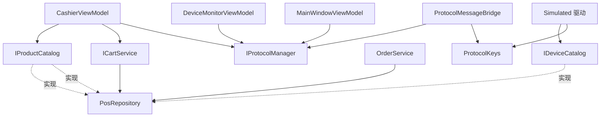

# 智汇 POS 收银终端（CommunityToolkitDemo）架构审查报告

> 审查范围：`Models / Messages / Protocols / Services / ViewModels / Views / Common` 全量代码与工程配置
> 审查维度：程序架构（扩展性、可维护性、安全性、耦合性）、代码简洁性、注释详细度
> 约束前提：**所有优化建议均为向后兼容改动**（不修改、不删除现有公开接口成员与公开类型）
> 基线状态：`net10.0-windows` + WPF + CommunityToolkit.Mvvm 8.4.2 + MS.DI 10.0.12；全工程编译/lint 0 诊断；无测试工程

---

## 一、总体结论

项目整体是一份**质量明显高于常见 Demo 水准**的 WPF MVVM 工程：分层清晰、DI 集中、注释解释了「为什么」而不只是「做什么」，并且在虚拟化、批量刷新、防抖、画刷冻结等性能细节上有真实思考。

主要短板集中在**架构边界的少数几处越层与反向依赖**，以及**扩展性设计上的一个结构性隐患**（协议管理器把「设备业务语义」和「按协议类型查找设备」写死在实现里），另有一批可清理的重复代码、死代码与设计令牌未复用问题。

| 维度 | 评级 | 核心结论 |
| --- | --- | --- |
| 架构分层 | 良好 B+ | 分层清晰、DI 集中注册且注释到位；存在 3 处越层、1 处反向依赖 |
| 扩展性 | 待改进 C+ | 驱动聚合设计优秀（开闭）；但管理器承载业务语义 + 按 `ProtocolType` 定位设备，同类型多设备不可区分 |
| 可维护性 | 良好 B | 注释优秀、性能细节到位；存在上帝对象、过大 ViewModel 与重复映射 |
| 耦合性 | 待改进 C+ | ViewModel 直连仓储、Services 反向依赖 Simulated 具体驱动、驱动依赖整个仓储 |
| 安全性 | 良好 B | 无真实网络通信、无凭据落盘；异常信息外露、数据文件无大小上限 |
| 代码简洁 | 良好 B- | 局部重复、1 处永不生效的异常兜底、4 个未使用的转换器 |
| 注释/文档 | 优秀 A- | 中文详实、解释设计取舍；少量历史性注释与缺失的 `<param>/<returns>` 可规范 |

---

## 二、值得保留的优秀实践（工程亮点）

1. **协议层开闭设计**：`ProtocolManager(IEnumerable<IProtocolDriver>)`（`Protocols/ProtocolManager.cs:20-30`）聚合全部驱动，新增一种协议只需在 DI 追加一行（`App.xaml.cs:112-116`），管理器本身无需改动。
2. **明确的线程模型**：后台驱动报文 → `ConcurrentQueue` 入队 → 150ms `DispatcherTimer` 批量刷 UI（`ViewModels/DeviceMonitorViewModel.cs:36,60-64,233-264`），把「每帧 N 次 UI 操作」降为「每 150ms 一次批量操作」。
3. **有意识的性能细节**：`VirtualizingWrapPanel`（`Common/Controls/VirtualizingWrapPanel.cs`）、`CachedContentControl` 视图缓存、`ListCollectionView` + `Filter` 不重建集合（`CashierViewModel.cs:70-73`）、搜索 250ms 防抖（`:81-87`）、`Freeze()` 画刷缓存（`Converters.cs:16-31`）、日期仅跨天格式化（`MainWindowViewModel.cs:268-272`）、订单上限裁剪（`PosRepository.cs:30,33-41`）、日志环形缓冲 200 条（`DeviceMonitorViewModel.cs:25,258-263`）。
4. **消息驱动解耦**：跨页联动全部走强类型消息（`Messages/` 9 个），使用 `WeakReferenceMessenger.Default`（`App.xaml.cs:104`），并用 `ObservableRecipient.IsActive` 管理订阅生命周期（`MainWindowViewModel.cs:184-195`、`DeviceMonitorViewModel.cs:186-209`、`CashierViewModel.cs:435-443`）。
5. **异常隔离**：`ProtocolManager.ConnectSafelyAsync/DisconnectSafelyAsync` 逐个隔离驱动异常（`:52-76`），单个设备失败不拖垮整体。
6. **安全基础良好**：无真实网络通信、无凭据落盘（设置为纯内存 `SettingsService`）、自定义 `DialogWindow` 替代 `MessageBox`、`Nullable` 全开、无路径遍历拼接。

---

## 三、问题清单

### P0 高优先级 —— 架构 / 耦合 / 扩展性

#### P0-1 ViewModel 越过服务层直连仓储（分层穿透）
- **现象**：`ViewModels/CashierViewModel.cs:31` 注入具体类 `PosRepository`，`:66` 读 `CategoriesWithAll`、`:70` 读 `Products`、`:458` 再读 `CategoriesWithAll`；`:450,477` 使用静态 `PosRepository.AllCategory`。`PosRepository` 是 `sealed` 具体类且无接口。
- **影响**：表现层直接依赖数据层，仓储的实现细节（集合类型、索引策略）变化会击穿到 UI；无法在测试中替换数据源。
- **优化**：新增只读契约 `Services/IProductCatalog.cs`（`CategoriesWithAll / Products / FindByBarcode / FindByCode / AllCategoryId`），由 `PosRepository` 实现（仅追加接口声明，不改动其任何现有成员）；`CashierViewModel` 构造参数改为 `IProductCatalog`；DI 中把接口映射到同一 `PosRepository` 单例，保持单实例语义。
- **兼容性**：新增接口 + 构造参数类型调整（非公开 API），`PosRepository` 公开成员零改动。

#### P0-2 服务层反向依赖具体模拟驱动（分层倒置）
- **现象**：`Services/ProtocolMessageBridge.cs:6` `using CommunityToolkitDemo.Protocols.Simulated;`，`:55` 使用 `SerialPortSimDriver.BarcodeKey`。
- **影响**：桥接器（Services）反向依赖具体驱动（Protocols.Simulated）。更换/替换串口驱动实现时，桥接器需同步修改。
- **优化**：新增协议中立常量类 `Protocols/ProtocolKeys.cs`（`Barcode`、`ScanCommand` 等）；`SerialPortSimDriver.BarcodeKey/ScanCommand` 保留（向后兼容）并赋值为该常量；`ProtocolMessageBridge` 改用中立常量并移除 `using ...Protocols.Simulated`。
- **兼容性**：纯新增 + 内部常量收敛；`SerialPortSimDriver` 公开常量保留。

#### P0-3 协议管理器承载业务语义 + 按协议类型定位设备（扩展性隐患）
- **现象**：`Protocols/IProtocolManager.cs:32-45` 暴露 `RequestBarcodeScanAsync / PushDisplayAmountAsync / OpenCashBoxAsync / PrintReceiptAsync / PublishOrderAsync`；`Protocols/ProtocolManager.cs:92-129` 内含 `AMT=`、`CASHBOX=OPEN`、`ESC/POS` 载荷拼接等设备语义；`Find(type)` 位于 `:174-175`，**只返回首个同类型驱动**，`SendToAsync` 位于 `:135-152`。
- **影响**：① 新增同类设备（第二台串口设备、第二块客显屏）时无法寻址；② 新增业务指令要改管理器；③ 设备语义散落在「管理器 + 驱动」两处。
- **优化（向后兼容范围内）**：将设备指令载荷收敛到 `ProtocolKeys`（与 P0-2 合并落地）；`Find` 增加「按类型 + 设备 Id」的内部重载并优先匹配 `Device.Id`，公开行为保持「无匹配时回退首个同类型驱动」。**接口方法本身不删除**——彻底的「指令描述符表 / 设备寻址」属破坏性重构，单列为后续批次，本次仅标注。
- **兼容性**：内部重载 + 常量收敛，公开接口无签名变化。

#### P0-4 服务定位器反模式
- **现象**：`ViewModels/MainWindowViewModel.cs:45` 持有 `IServiceProvider`，`:179` `_services.GetService(viewModelType)` 解析页面 VM（`PageMap` 见 `:36-41`）。
- **影响**：隐藏真实依赖，编译期无法发现缺失注册；不利于单元测试。
- **优化（向后兼容）**：改为构造注入 `Func<string, ObservableObject?>` 或用更小的 `IPageViewModelFactory` 抽象。⚠️ 该改动会调整 `MainWindowViewModel` 构造函数签名，属内部改动但影响面较广，**列为独立小批次**（见批次 B8）。
- **兼容性**：公开接口（7 个 Service/Protocol 接口）不受影响。

#### P0-5 解析式副作用 + fire-and-forget 初始化
- **现象**：`App.xaml.cs:41` `Services.GetRequiredService<ProtocolMessageBridge>();` 仅为触发事件订阅（返回值丢弃）；`:49` `_ = InitializeAsync();`，异常仅 `Debug.WriteLine`（`:70-73`），失败对用户不可见。
- **影响**：① 「为副作用而解析」是隐式契约，后续重构易误删；② 初始化失败静默，用户看不到任何提示。
- **优化**：`App` 显式持有 `ProtocolMessageBridge` 字段（分离 `Start()` 语义或保留构造订阅 + 注释说明）；`InitializeAsync` 失败时经 `StatusNotificationMessage` 上报到全局提示条，`Debug` 记录保留。
- **兼容性**：`App` 内部改动，无公开接口变化。

#### P0-6 `PosRepository` 上帝对象
- **现象**：`Services/PosRepository.cs:13-102` 同时承担商品/分类/设备/订单存储、`CategoriesWithAll` 视图构造（`:70-81`）、`AddOrder` 裁剪（`:33-41`）、`GetDeviceOrDefault`（`:99-101`）、条码/编码索引查找（`:86-93`）。
- **影响**：任一消费者（4 个服务/VM + 5 个驱动，共 10 处）都拿到全部能力，职责扩散；改动风险集中。
- **优化**：**不拆类型**，改为「按最小接口分段暴露」——新增 `IProductCatalog`（P0-1）、`IDeviceCatalog`（P0-7）、`IOrderStore`，由 `PosRepository` 统一实现，调用方依赖最小契约。保留 `PosRepository` 作为唯一数据落点。
- **兼容性**：纯新增接口，`PosRepository` 公开成员不变。

#### P0-7 传输层耦合数据层
- **现象**：5 个模拟驱动构造函数均接收 `PosRepository`，仅用于 `GetDeviceOrDefault`：`ModbusTcpSimDriver.cs:18-19`、`OpcUaSimDriver.cs:15-16`、`SerialPortSimDriver.cs:21,24-25`、`SocketSimDriver.cs:19-20`、`MqttSimDriver.cs:13-14`；其中仅 `SerialPortSimDriver` 额外使用 `Products`（`:94,96`）。
- **影响**：驱动（协议层）拿到整个仓储，可越权访问订单/商品；测试驱动必须构造完整仓储。
- **优化**：新增 `Services/IDeviceCatalog.cs`（`GetDeviceOrDefault`），由 `PosRepository` 实现；驱动构造参数改为 `IDeviceCatalog`。`SerialPortSimDriver` 对 `Products` 的使用改为经 `IProductCatalog`（或保留 `PosRepository` 并显式声明，属可选强化）。
- **兼容性**：纯新增接口 + 驱动内部构造改动，驱动公开成员不变。

#### P0-8 集合封装泄漏
- **现象**：`Protocols/ProtocolManager.cs:32` `public IReadOnlyList<IProtocolDriver> Drivers => _drivers;` 直接返回内部 `List<IProtocolDriver>`。
- **影响**：调用方可向下转型为 `List<>` 后增删，破坏管理器与驱动事件订阅的一致性（新驱动不会被订阅）。
- **优化**：返回 `_drivers.AsReadOnly()`（或 `ReadOnlyCollection` 包装）。
- **兼容性**：属性类型不变（仍为 `IReadOnlyList<IProtocolDriver>`）。

### P1 中优先级 —— 正确性 / 稳健性

#### P1-9 索引与线性查找不一致
- **现象**：`DeviceMonitorViewModel.cs:33` 已建 `_cardIndex`（`:46-49` 填充、`:274` 使用），但 `ApplyDriverState` `:313-321` 仍 `Cards.FirstOrDefault(c => c.Type == driver.Type)`；`MainWindowViewModel.cs:255` 同样 `ProtocolStatuses.FirstOrDefault(s => s.Type == driver.Type)`。
- **影响**：与自身注释「避免每帧线性查找」矛盾；状态变化频繁时产生无谓的线性扫描。
- **优化**：`ApplyDriverState` 改用 `_cardIndex.TryGetValue`；`MainWindowViewModel` 增加 `Dictionary<ProtocolType, ProtocolStatusItem>` 索引。
- **兼容性**：纯内部实现。

#### P1-10 跨线程状态可见性
- **现象**：`Protocols/ProtocolDriverBase.cs:18` `private ConnectionState _state` 非 `volatile`；`:32-45` getter 由 UI 线程读、setter 由后台 loop 线程写；`StateChanged` 在 `:43` 后台线程触发。
- **影响**：枚举底层为 int，读写原子但**可见性无保证**，理论上 UI 可能长时间读到旧值（低概率、低严重度）。
- **优化**：`get => Volatile.Read(ref _state);`、setter 用 `Volatile.Write(ref _state, value)`。
- **兼容性**：纯内部实现。

#### P1-11 并行任务写入非线程安全集合
- **现象**：`Services/MarkdownDataService.cs:20` `private readonly List<string> _errors`，在 `:66,79` 由 4 个并行 `ReadAsync`（`:37-42` `Task.WhenAll`）写入。
- **影响**：**当前**因 `LoadAsync` 由 UI 线程调用、continuation 回到 UI 同步上下文而实际串行，无语义竞态；但一旦改由 `Task.Run`/无同步上下文调用即产生竞态（脆弱）。
- **优化**：让 `ReadAsync` 返回 `(items, error?)` 结果对象，`LoadAsync` 在 `WhenAll` 后**统一汇总**（保持 `LoadErrors` 顺序稳定）。
- **兼容性**：`IMarkdownDataService.LoadErrors` 语义与类型不变。

#### P1-12 永不生效的异常兜底
- **现象**：`Views/DialogWindow.xaml.cs:138` `(Style)FindResource("WarningButton") ?? (Style)FindResource("PrimaryButton")` —— `FindResource` 找不到键会**抛异常**而非返回 null，`??` 永不生效（`WarningButton` 实际存在于 `Common/Styles/Controls.xaml:248`）。
- **影响**：误导阅读者以为有兜底，实际是死代码。
- **优化**：改用 `TryFindResource` 并保留中性兜底（与同文件 `FindBrush` `:143-152` 风格一致）。
- **兼容性**：`DialogWindow` 公开成员不变。

#### P1-13 `IsMaxQuantity` 语义不一致且未被使用（**用户已确认修复**）
- **现象**：`Models/CartItem.cs:37` `IsMaxQuantity => Quantity >= Product.Stock`，未考虑 `AllowOversell`；而 `Services/CartService.cs:23-24` `MaxQuantityOf` 在允许超卖时返回 `int.MaxValue`。grep 确认该属性在全部 XAML/C# 中**零引用**。
- **影响**：属性语义与业务规则冲突；且 UI 无「已达上限」的视觉/交互反馈。
- **优化（已确认）**：让 `CartItem` 持有 `MaxQuantity`（由 `CartService` 写入），`IsMaxQuantity => Quantity >= MaxQuantity`；并在 `Views/CashierView.xaml` 购物车「+」按钮上接入 `IsMaxQuantity`（达上限时禁用并给出提示）。
- **兼容性**：新增属性 + 既有属性语义修正（属用户确认的行为变更）。

#### P1-14 零库存边界缺陷（**用户已确认修复**）
- **现象**：`Services/CartService.cs:47` `Math.Clamp(quantity, 1, Math.Max(maxQuantity, 1))`，当 `Stock=0` 且不允许超卖时仍会加入 1 件（`Math.Max(...,1)` 抬高了上限）；`Increase`（`:76`）同样不拦截。`Data/products.md` 当前无 `Stock=0` 记录，属未触发隐患。
- **影响**：零库存商品可被加入购物车，业务上不成立。
- **优化（已确认）**：不允许超卖时，`Stock<=0` 直接拒绝加购（`Add`/`TryAddByBarcode` 返回失败 + 提示；`Increase` 返回 false）。
- **兼容性**：`ICartService.Add` 签名不变，行为按用户确认调整。

#### P1-15 无 Dispatcher 时同步执行（掩盖问题）
- **现象**：`Common/UiDispatcher.cs:22-27`，`Application.Current` 为 null 时在**调用线程**直接 `action()`。
- **影响**：生产环境非空，风险低；但会掩盖「后台线程直改 UI 集合」的错误，在无 UI 上下文时静默执行。
- **优化**：无 `Application` 时显式记录（`Debug.WriteLine`）并保持原有同步执行语义，或改为 `Dispatcher.CurrentDispatcher`；明确写下取舍注释。
- **兼容性**：纯内部实现。

#### P1-16 异常被全量吞掉
- **现象**：`App.xaml.cs:141-146` 弹出 `e.Exception.Message` 且统一 `e.Handled = true`，仅 `Debug.WriteLine`，无文件日志。
- **影响**：所有 UI 异常都被标记为「已处理」，缺陷被掩盖；现场无法回溯。
- **优化**：增加轻量文件日志（如 `%LOCALAPPDATA%` 下 `error.log`），并区分致命/非致命；`Handled` 策略谨慎评估。
- **兼容性**：`App` 内部改动。

#### P1-17 `Task.WhenAll` 后取 `.Result`（风格/一致性）
- **现象**：`ViewModels/CashierViewModel.cs:329-331` `printTask.Result / cashBoxTask.Result / uploadTask.Result`。
- **影响**：成功路径无阻塞，但风格不一致，易被误读为 sync-over-async。
- **优化**：改为 `var results = await Task.WhenAll(printTask, cashBoxTask, uploadTask);` 后按索引取值。
- **兼容性**：纯内部实现。

### P2 低优先级 —— 重复逻辑 / 设计令牌 / 死代码 / 工程化

#### P2-18 重复映射逻辑三处
| 复制点 | ViewModel 侧 | Converter 侧 |
| --- | --- | --- |
| 协议短名 | `MainWindowViewModel.cs:241-249` `ShortNameOf` | `Converters.cs:158-173` `ProtocolTypeToShortTextConverter` |
| 连接状态文本 | `DeviceCardViewModel.cs:61-67` `StateText` | `Converters.cs:124-137` `ConnectionStateToTextConverter` |
| 支付方式文本 | `Models/Order.cs:43-49` `PaymentText` | `Converters.cs:240-253` `PaymentMethodToTextConverter` |

- **优化**：抽取 `Models/ProtocolDisplay.cs`（协议短名/全名、连接状态文本、支付方式文本），ViewModel 与 Converter 共用。
- **兼容性**：纯内部实现，`Order.PaymentText` 保留。

#### P2-19 转换器内硬编码 RGB 与设计令牌重复
- **现象**：`Converters.cs:105-108`（Disconnected/Connecting/Connected/Faulted）、`:268-271`（StatusLevel 四色）、`:289-294`（协议五色）与 `Common/Styles/Colors.xaml` 令牌重复。
- **优化**：常量抽到与 `Colors.xaml` 同源的取值处并加注释交叉引用（转换器不能用 `StaticResource`，需保留 RGB，仅做可追溯收敛）。
- **兼容性**：纯内部实现，视觉零变化。

#### P2-20 视图硬编码颜色绕过设计令牌
- **现象**：`Views/MainWindow.xaml:45,63,82,105,166,188,192,216,219`（`#1E293B`/`#475569`/`#94A3B8`/`#E2E8F0`/`#64748B`）、`Views/CashierView.xaml:407,411`（`#93C5FD`）、`Views/DialogWindow.xaml:47`（`#730F172A`）。
- **对应令牌**：`NavBackgroundAltBrush`/`NavHoverBrush`（`Colors.xaml:21-22`）、`TextSecondaryBrush`（`:26`）、`TextMutedBrush`/`TextOnDarkMutedBrush`（`:27,29`）、`DividerBrush`（`:44`）、`PrimaryLightBrush`（`:12`）；遮罩色**无令牌**。
- **优化**：替换为 `{StaticResource ...}`；`Colors.xaml` 新增 `DialogMaskBrush`。
- **兼容性**：纯 XAML + 新增资源键，视觉保持不变。

#### P2-21 未使用的公开转换器（死代码）
- **清单**：`InverseBooleanConverter`（`Converters.cs:71-78`）、`EqualityToBooleanConverter`（`:176-195`）、`TimeTextConverter`（`:230-237`）、`PaymentMethodToTextConverter`（`:240-253`）——全量 XAML grep 无任何 `StaticResource` 引用。
- **优化（保守方案，本次采用）**：保留类型（属公开成员，删除违反兼容性红线），补 `/// <remarks>` 说明其用途与「当前未使用」状态，避免被误判为可删。
- **兼容性**：不删除任何公开成员。

#### P2-22 `CashierViewModel` 过大
- **现象**：546 行，单类承担商品浏览、分类过滤、搜索防抖、扫码加购、结算校验、外设编排（`:296-359`）、提示拼装（`:532-543`）。
- **优化**：抽取内部协作者（如 `CheckoutCoordinator`），保持命令名与 XAML 绑定路径不变；分批进行。
- **兼容性**：XAML 绑定路径不变。

#### P2-23 ViewModel 冗余透传状态
- **现象**：`CashierViewModel.cs:138-147` 的 `Total/ItemCount/KindCount/HasItems` 从 `_cart` 重复计算，并由 `NotifyCartChanged()`（`:520-529`）手工逐一通知；而 `Messages/MessagePayloads.cs` 的 `CartChangedMessage` 已携带 `CartSummary`。
- **优化**：缓存 `CartSummary`，派生属性基于缓存计算，集中通知。
- **兼容性**：公开属性名不变，XAML 绑定不变。

#### P2-24 工程化缺口
- **现象**：`CommunityToolkitDemo.csproj:20-21` `EnforceCodeStyleInBuild=false`、`GenerateDocumentationFile=false`；无测试工程。
- **优化**：开启 `GenerateDocumentationFile`（配 `NoWarn` 控制未注释公开成员告警）；新增 `CommunityToolkitDemo.Tests`（xUnit）覆盖 `MarkdownTableParser`、`CartService` 上限逻辑、`ProtocolDriverBase` 状态机、`Converters`。
- **兼容性**：仅工程配置与新增测试工程。

### 安全专章（均为低风险）

| 编号 | 问题 | 位置 | 评估与处置 |
| --- | --- | --- | --- |
| S1 | 异常信息直接展示给用户 | `App.xaml.cs:144` | 信息外露（低）。改为展示友好文案 + 文件日志留存详情 |
| S2 | 数据文件无大小上限 | `Services/MarkdownDataService.cs:70` | 超大文件致内存膨胀（低）。增加 `FileInfo.Length` 上限校验 |
| S3 | `DialogWindow.Owner` 可能为 null | `Views/DialogWindow.xaml.cs:99` | 仅影响模态归属与居中，非安全问题 |
| S4 | 路径拼接 | `MarkdownDataService.cs:14-17,25,60` | **确认安全**：`AppContext.BaseDirectory` + 常量文件名，无遍历风险 |
| S5 | 凭据落盘 | `Services/SettingsService.cs` | **确认安全**：设置为纯内存，无凭据持久化 |
| S6 | 真实网络通信 | 全部驱动为模拟 | **确认安全**：无 TLS/认证面；接入真实设备时需重新评估指令注入（当前 `amount` 由 `decimal.ToString` 输出，安全） |

---

## 四、优化方案（分批，全部向后兼容）

### 批次 A：P0 结构性解耦
| 项 | 内容 | 涉及文件 |
| --- | --- | --- |
| A1 | 新增 `IProductCatalog`，`PosRepository` 实现，`CashierViewModel` 依赖接口，DI 映射同一单例 | `Services/IProductCatalog.cs`(新)、`PosRepository.cs`、`CashierViewModel.cs`、`App.xaml.cs` |
| A2 | 新增协议中立常量 `ProtocolKeys`，桥接器去除对 `Simulated` 的依赖 | `Protocols/ProtocolKeys.cs`(新)、`SerialPortSimDriver.cs`、`ProtocolMessageBridge.cs` |
| A3 | 查找统一走索引 | `DeviceMonitorViewModel.cs`、`MainWindowViewModel.cs` |
| A4 | `State` 采用 `Volatile` 读写 | `ProtocolDriverBase.cs` |
| A5 | 错误汇总线程安全化 | `MarkdownDataService.cs` |
| A6 | 按钮样式改用 `TryFindResource` | `DialogWindow.xaml.cs` |
| A7 | `App` 显式持有桥接器 + 初始化异常上报 UI | `App.xaml.cs` |
| A8 | 新增 `IDeviceCatalog`，驱动依赖最小接口 | `Services/IDeviceCatalog.cs`(新)、`PosRepository.cs`、5 个驱动 |

### 批次 B：P1/P2 正确性与可维护性
| 项 | 内容 |
| --- | --- |
| B1 | 抽取 `Models/ProtocolDisplay.cs`，消除三处重复映射 |
| B2 | 设计令牌统一（MainWindow / CashierView / DialogWindow），新增 `DialogMaskBrush` |
| B3 | `CashierViewModel` 透传属性基于 `CartSummary` 计算并集中通知 |
| B4 | `ProtocolManager.Drivers` 返回只读包装 |
| B5 | `UiDispatcher` 无 Dispatcher 时行为明确化 |
| B6 | `CheckoutAsync` 去 `.Result` 并抽取结算协作者 |
| B7 | 死代码转换器补注释说明（不删除） |
| B8 | `MainWindowViewModel` 服务定位器替换（独立小批次） |
| B9 | 用户确认的行为变更：`IsMaxQuantity` 语义对齐 + 接入绑定；零库存不可加购 |

### 批次 C：低优先级规范与工程化
| 项 | 内容 |
| --- | --- |
| C1 | 命名与注释规范化（`ShortNameOf` 等）、补全缺失的 `<param>/<returns>` |
| C2 | `GenerateDocumentationFile` + 分析器配置；新增 `CommunityToolkitDemo.Tests`（xUnit） |
| C3 | `OnDispatcherUnhandledException` 增加文件日志与致命/非致命区分 |
| C4 | `MarkdownDataService` 增加数据文件大小上限校验 |

---

## 五、兼容性红线

**禁止**：修改或删除 `IProtocolManager`、`IProtocolDriver`、`ICartService`、`IOrderService`、`ISettingsService`、`IMarkdownDataService`、`IDialogService` 的既有成员；删除任何现有公开类型/成员（含 4 个未使用转换器）。

**允许**：新增接口、类型、常量、资源键；修改 `internal/private` 实现；调整 DI 注册；调整 XAML（保持绑定路径语义）。

**已确认的行为变更**（本次实施）：
1. `CartItem.IsMaxQuantity` 语义与 `AllowOversell` 对齐，并接入 `CashierView.xaml` 的「+」按钮。
2. `CartService` 零库存商品不可加入购物车。

---

## 六、改造后依赖方向

要点：表现层只依赖接口；桥接器不再依赖具体模拟驱动；驱动只依赖设备配置接口而非整个仓储；`PosRepository` 保持唯一数据落点。

---

## 七、验收标准

1. 每批次结束执行 `dotnet build`，要求 **0 error / 0 warning**；全工程 lint 0 诊断。
2. 非行为变更批次（B2 等）需保证 UI 视觉与交互完全一致（颜色逐项比对）。
3. 新增测试工程全部通过。
4. 公开接口调用方（`App.xaml.cs` DI 注册、各 ViewModel / 服务 / 驱动）均不因改动产生编译错误 —— 即「无公开成员破坏」。
